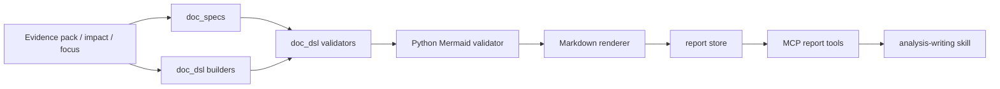
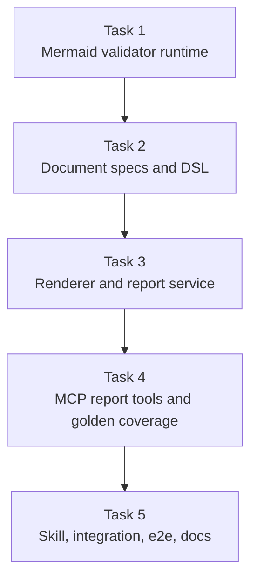
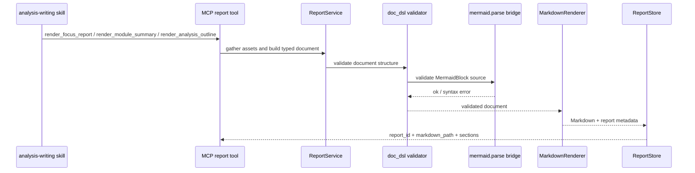

# M4 Document DSL and Rendering Implementation Plan

> **For agentic workers:** REQUIRED SUB-SKILL: Use superpowers:subagent-driven-development (recommended) or superpowers:executing-plans to implement this plan task-by-task. Steps use checkbox (`- [ ]`) syntax for tracking.

**Goal:** Make the report path real by turning evidence-backed analysis assets into typed documents with first-class Mermaid blocks, validating them through Python, and rendering stable Markdown artifacts through the `report` domain.

**Architecture:** Build M4 around four layers that stay sharply separated: `doc_specs` defines document-shape policy, `doc_dsl` defines typed blocks and validation, `renderers` turns validated documents into Markdown, and `report` persists rendered artifacts under `<target_repo>/.codewiki/report/`. Keep Mermaid validation Python-owned by calling the official `mermaid.parse(text)` through a tiny checked-in Node bridge, so the document pipeline stays deterministic without turning the repository into a Node application.

**Tech Stack:** Python 3.11 (`/home/hyx/anaconda3/envs/agent/bin/python`), stdlib `unittest`, stdlib `dataclasses`/`json`/`subprocess`/`pathlib`, MCP Python SDK (`mcp[cli]`), Node.js with npm package `mermaid@11.14.0`, Markdown skill files under `.agents/skills/`

---

## Architecture Sketch







## File Structure

- Modify: `.gitignore`
  Responsibility: ignore `node_modules/` for the Mermaid validator runtime.
- Create: `package.json`
  Responsibility: pin the single Node dependency needed for the official Mermaid parser.
- Create: `tools/validate_mermaid.mjs`
  Responsibility: invoke `mermaid.parse(text)` and return machine-readable JSON to Python.
- Create: `src/repo_analysis_tools/doc_specs/base.py`
  Responsibility: shared document-spec models, section policies, and registry helpers.
- Create: `src/repo_analysis_tools/doc_specs/module_summary.py`
  Responsibility: section and Mermaid policy for `module-summary`.
- Create: `src/repo_analysis_tools/doc_specs/issue_analysis.py`
  Responsibility: section and Mermaid policy for `issue-analysis`.
- Create: `src/repo_analysis_tools/doc_specs/design_note.py`
  Responsibility: section and Mermaid policy for `design-note`.
- Create: `src/repo_analysis_tools/doc_specs/review_report.py`
  Responsibility: section and Mermaid policy for `review-report`.
- Create: `src/repo_analysis_tools/doc_dsl/models.py`
  Responsibility: typed document, section, evidence, finding, and `MermaidBlock` models.
- Create: `src/repo_analysis_tools/doc_dsl/mermaid_validator.py`
  Responsibility: Python-owned adapter around the official Mermaid parser.
- Create: `src/repo_analysis_tools/doc_dsl/validators.py`
  Responsibility: enforce document-spec rules and Mermaid validation order.
- Create: `src/repo_analysis_tools/doc_dsl/builders.py`
  Responsibility: convert evidence and impact assets into typed document objects for the supported document types.
- Create: `src/repo_analysis_tools/renderers/sections.py`
  Responsibility: stable section ordering and heading emission.
- Create: `src/repo_analysis_tools/renderers/citations.py`
  Responsibility: shared evidence-binding and citation formatting.
- Create: `src/repo_analysis_tools/renderers/markdown.py`
  Responsibility: render validated typed documents into Markdown with Mermaid fenced blocks.
- Create: `src/repo_analysis_tools/report/models.py`
  Responsibility: persisted report artifact model and report summaries returned by MCP.
- Create: `src/repo_analysis_tools/report/store.py`
  Responsibility: persist `report_<12-hex>` metadata JSON and rendered Markdown files under `.codewiki/report/`.
- Create: `src/repo_analysis_tools/report/service.py`
  Responsibility: gather evidence assets, choose document specs, validate, render, and persist report artifacts.
- Modify: `src/repo_analysis_tools/mcp/contracts/report.py`
  Responsibility: replace M1/M3 report stubs with real M4 output shapes and the new `document_type` input on `render_focus_report`.
- Modify: `src/repo_analysis_tools/mcp/tools/report_tools.py`
  Responsibility: replace stubs with `ReportService`-backed implementations.
- Create: `tests/unit/test_mermaid_validator.py`
  Responsibility: prove the Python validator adapter accepts valid diagrams and rejects invalid Mermaid syntax.
- Create: `tests/unit/test_document_dsl.py`
  Responsibility: verify spec registry coverage, `MermaidBlock` rules, and document validation behavior.
- Create: `tests/unit/test_report_service.py`
  Responsibility: validate typed-document rendering and persisted report artifacts.
- Modify: `tests/contract/test_tool_contracts.py`
  Responsibility: verify the real M4 report-tool inputs, outputs, and recommended-next-tool flow.
- Modify: `tests/golden/test_contract_golden.py`
  Responsibility: snapshot a deterministic rendered report payload.
- Create: `tests/golden/fixtures/render_module_summary_scope_first.json`
  Responsibility: golden fixture for the first real report payload.
- Create: `tests/integration/test_analysis_writing_workflow.py`
  Responsibility: prove the synthetic repo supports end-to-end document rendering from evidence.
- Create: `tests/e2e/test_analysis_writing_easyflash.py`
  Responsibility: validate Mermaid-rich document rendering on the checked-in EasyFlash fixture.
- Create: `.agents/skills/analysis-writing/SKILL.md`
  Responsibility: Codex workflow skill for structured document authoring through MCP report tools.
- Modify: `docs/architecture.md`
  Responsibility: document the M4 document pipeline and persisted report artifacts.
- Modify: `docs/contracts/mcp-tool-contracts.md`
  Responsibility: document the real M4 report tool contracts.

## Working Set

- Parent design: `docs/superpowers/specs/2026-04-17-repo-analysis-platform-design.md`
- M4 spec: `docs/superpowers/specs/2026-04-17-m4-document-dsl-and-rendering-spec.md`
- Existing architecture notes: `docs/architecture.md`
- Existing MCP contract docs: `docs/contracts/mcp-tool-contracts.md`
- Existing evidence services: `src/repo_analysis_tools/evidence/`
- Existing impact services: `src/repo_analysis_tools/impact/`
- Existing report contract surface: `src/repo_analysis_tools/mcp/contracts/report.py`, `src/repo_analysis_tools/mcp/tools/report_tools.py`
- Existing synthetic fixture: `tests/fixtures/scope_first_repo.py`
- Existing real fixture helper: `tests/fixtures/easyflash_repo.py`

## Design Assumption

M4 introduces a narrow Node dependency even though the repository is Python-first. That is intentional: the application runtime and persistence model remain Python-owned, while Mermaid syntax validation is delegated to the official Mermaid parser through a tiny checked-in bridge script instead of a community-maintained Python parser.

### Task 1: Add the Official Mermaid Validation Runtime

**Files:**
- Modify: `.gitignore`
- Create: `package.json`
- Create: `tools/validate_mermaid.mjs`
- Create: `src/repo_analysis_tools/doc_dsl/mermaid_validator.py`
- Create: `tests/unit/test_mermaid_validator.py`

- [ ] **Step 1: Write the failing Mermaid validator tests**

Create `tests/unit/test_mermaid_validator.py`:

```python
import unittest

from repo_analysis_tools.doc_dsl.mermaid_validator import MermaidSyntaxError, MermaidValidator


class MermaidValidatorTest(unittest.TestCase):
    def test_valid_flowchart_passes(self) -> None:
        validator = MermaidValidator()

        result = validator.validate(
            "flowchart LR\nA[Scan] --> B[Render]\n",
            diagram_kind="flowchart",
        )

        self.assertEqual(result.diagram_type, "flowchart")

    def test_invalid_diagram_raises_syntax_error(self) -> None:
        validator = MermaidValidator()

        with self.assertRaises(MermaidSyntaxError) as context:
            validator.validate(
                "flowchart LR\nA[Scan] -->\n",
                diagram_kind="flowchart",
            )

        self.assertIn("Mermaid syntax error", str(context.exception))
```

- [ ] **Step 2: Run the validator tests and verify they fail**

Run: `/home/hyx/anaconda3/envs/agent/bin/python -m unittest tests.unit.test_mermaid_validator -v`
Expected: FAIL with `ModuleNotFoundError: No module named 'repo_analysis_tools.doc_dsl.mermaid_validator'`.

- [ ] **Step 3: Add the Node bridge and the Python validator adapter**

Update `.gitignore`:

```gitignore
.worktrees/
__pycache__/
node_modules/
```

Create `package.json`:

```json
{
  "name": "repo-analysis-tools",
  "private": true,
  "type": "module",
  "dependencies": {
    "mermaid": "11.14.0"
  }
}
```

Create `tools/validate_mermaid.mjs`:

```javascript
import mermaid from "mermaid";
import { readFileSync } from "node:fs";

mermaid.initialize({ startOnLoad: false });

const payload = JSON.parse(readFileSync(0, "utf8"));

try {
  const result = await mermaid.parse(payload.source);
  process.stdout.write(
    JSON.stringify({
      ok: true,
      diagramType: result.diagramType ?? payload.diagram_kind ?? null
    })
  );
} catch (error) {
  process.stdout.write(
    JSON.stringify({
      ok: false,
      error: error?.message ?? String(error)
    })
  );
  process.exitCode = 1;
}
```

Create `src/repo_analysis_tools/doc_dsl/mermaid_validator.py`:

```python
from __future__ import annotations

from dataclasses import dataclass
import json
from pathlib import Path
import subprocess


REPO_ROOT = Path(__file__).resolve().parents[3]
MERMAID_VALIDATE_SCRIPT = REPO_ROOT / "tools" / "validate_mermaid.mjs"


class MermaidSyntaxError(ValueError):
    pass


@dataclass(frozen=True)
class MermaidValidationResult:
    diagram_type: str | None


class MermaidValidator:
    def __init__(self, *, node_binary: str = "node") -> None:
        self.node_binary = node_binary

    def validate(self, source: str, *, diagram_kind: str | None = None) -> MermaidValidationResult:
        payload = json.dumps({"source": source, "diagram_kind": diagram_kind})
        completed = subprocess.run(
            [self.node_binary, str(MERMAID_VALIDATE_SCRIPT)],
            input=payload,
            text=True,
            capture_output=True,
            check=False,
        )
        response = json.loads(completed.stdout or "{}")
        if completed.returncode != 0 or not response.get("ok"):
            detail = response.get("error") or completed.stderr.strip() or "unknown Mermaid validation failure"
            raise MermaidSyntaxError(f"Mermaid syntax error: {detail}")
        return MermaidValidationResult(diagram_type=response.get("diagramType"))
```

- [ ] **Step 4: Install the Mermaid dependency**

Run: `npm install`
Expected: PASS and create `package-lock.json` plus a local `node_modules/mermaid` tree.

- [ ] **Step 5: Run the validator tests and verify they pass**

Run: `/home/hyx/anaconda3/envs/agent/bin/python -m unittest tests.unit.test_mermaid_validator -v`
Expected: PASS with one valid-diagram case and one syntax-error case green.

- [ ] **Step 6: Commit the Mermaid validation runtime**

```bash
git add .gitignore package.json package-lock.json tools/validate_mermaid.mjs src/repo_analysis_tools/doc_dsl/mermaid_validator.py tests/unit/test_mermaid_validator.py
git commit -m "feat: add Mermaid validation bridge"
```

### Task 2: Define Document Specs and Typed DSL Blocks

**Files:**
- Create: `src/repo_analysis_tools/doc_specs/base.py`
- Create: `src/repo_analysis_tools/doc_specs/module_summary.py`
- Create: `src/repo_analysis_tools/doc_specs/issue_analysis.py`
- Create: `src/repo_analysis_tools/doc_specs/design_note.py`
- Create: `src/repo_analysis_tools/doc_specs/review_report.py`
- Create: `src/repo_analysis_tools/doc_dsl/models.py`
- Create: `src/repo_analysis_tools/doc_dsl/validators.py`
- Create: `src/repo_analysis_tools/doc_dsl/builders.py`
- Create: `tests/unit/test_document_dsl.py`

- [ ] **Step 1: Write the failing document-spec and DSL tests**

Create `tests/unit/test_document_dsl.py`:

```python
import unittest

from repo_analysis_tools.doc_dsl.models import Document, MermaidBlock, Section, TextBlock
from repo_analysis_tools.doc_dsl.validators import validate_document
from repo_analysis_tools.doc_specs.base import build_document_spec_registry


class DocumentDslTest(unittest.TestCase):
    def test_registry_exposes_all_m4_document_types(self) -> None:
        registry = build_document_spec_registry()

        self.assertEqual(
            set(registry),
            {"module-summary", "issue-analysis", "design-note", "review-report"},
        )
        self.assertEqual(
            registry["design-note"].section_policies["Flow"].mermaid_policy,
            "required",
        )

    def test_validator_rejects_missing_required_mermaid_block(self) -> None:
        document = Document(
            document_type="design-note",
            title="Flash write flow",
            sections=[
                Section(title="Context", blocks=[TextBlock(text="Context text")]),
                Section(title="Flow", blocks=[TextBlock(text="Only prose here")]),
            ],
        )

        errors = validate_document(document, build_document_spec_registry()["design-note"])

        self.assertIn("section 'Flow' requires at least one MermaidBlock", errors)

    def test_validator_rejects_mermaid_block_in_disallowed_section(self) -> None:
        document = Document(
            document_type="module-summary",
            title="flash",
            sections=[
                Section(
                    title="Recommendations",
                    blocks=[
                        MermaidBlock(
                            diagram_kind="flowchart",
                            source="flowchart LR\nA-->B\n",
                            caption="Should not be here",
                            placement="inline",
                            evidence_bindings=[],
                        )
                    ],
                )
            ],
        )

        errors = validate_document(document, build_document_spec_registry()["module-summary"])

        self.assertIn("section 'Recommendations' disallows MermaidBlock", errors)
```

- [ ] **Step 2: Run the DSL tests and verify they fail**

Run: `/home/hyx/anaconda3/envs/agent/bin/python -m unittest tests.unit.test_document_dsl -v`
Expected: FAIL with `ModuleNotFoundError` for `repo_analysis_tools.doc_dsl.models` or `repo_analysis_tools.doc_specs.base`.

- [ ] **Step 3: Add document-spec registry and typed block models**

Create `src/repo_analysis_tools/doc_specs/base.py`:

```python
from __future__ import annotations

from dataclasses import dataclass


@dataclass(frozen=True)
class SectionPolicy:
    title: str
    mermaid_policy: str


@dataclass(frozen=True)
class DocumentSpec:
    document_type: str
    required_sections: tuple[str, ...]
    section_policies: dict[str, SectionPolicy]


def build_document_spec_registry() -> dict[str, DocumentSpec]:
    from repo_analysis_tools.doc_specs.design_note import DESIGN_NOTE_SPEC
    from repo_analysis_tools.doc_specs.issue_analysis import ISSUE_ANALYSIS_SPEC
    from repo_analysis_tools.doc_specs.module_summary import MODULE_SUMMARY_SPEC
    from repo_analysis_tools.doc_specs.review_report import REVIEW_REPORT_SPEC

    return {
        MODULE_SUMMARY_SPEC.document_type: MODULE_SUMMARY_SPEC,
        ISSUE_ANALYSIS_SPEC.document_type: ISSUE_ANALYSIS_SPEC,
        DESIGN_NOTE_SPEC.document_type: DESIGN_NOTE_SPEC,
        REVIEW_REPORT_SPEC.document_type: REVIEW_REPORT_SPEC,
    }
```

Create `src/repo_analysis_tools/doc_specs/module_summary.py`:

```python
from repo_analysis_tools.doc_specs.base import DocumentSpec, SectionPolicy


MODULE_SUMMARY_SPEC = DocumentSpec(
    document_type="module-summary",
    required_sections=("Summary", "Key Anchors", "Call Flow", "Risks", "Recommendations"),
    section_policies={
        "Summary": SectionPolicy("Summary", "allowed"),
        "Key Anchors": SectionPolicy("Key Anchors", "allowed"),
        "Call Flow": SectionPolicy("Call Flow", "required"),
        "Risks": SectionPolicy("Risks", "allowed"),
        "Recommendations": SectionPolicy("Recommendations", "disallowed"),
    },
)
```

Create `src/repo_analysis_tools/doc_specs/issue_analysis.py`:

```python
from repo_analysis_tools.doc_specs.base import DocumentSpec, SectionPolicy


ISSUE_ANALYSIS_SPEC = DocumentSpec(
    document_type="issue-analysis",
    required_sections=("Issue Summary", "Evidence", "Causal Chain", "Unknowns", "Recommendations"),
    section_policies={
        "Issue Summary": SectionPolicy("Issue Summary", "allowed"),
        "Evidence": SectionPolicy("Evidence", "allowed"),
        "Causal Chain": SectionPolicy("Causal Chain", "required"),
        "Unknowns": SectionPolicy("Unknowns", "allowed"),
        "Recommendations": SectionPolicy("Recommendations", "disallowed"),
    },
)
```

Create `src/repo_analysis_tools/doc_specs/design_note.py`:

```python
from repo_analysis_tools.doc_specs.base import DocumentSpec, SectionPolicy


DESIGN_NOTE_SPEC = DocumentSpec(
    document_type="design-note",
    required_sections=("Context", "Proposed Design", "Flow", "Tradeoffs", "Open Questions"),
    section_policies={
        "Context": SectionPolicy("Context", "allowed"),
        "Proposed Design": SectionPolicy("Proposed Design", "allowed"),
        "Flow": SectionPolicy("Flow", "required"),
        "Tradeoffs": SectionPolicy("Tradeoffs", "allowed"),
        "Open Questions": SectionPolicy("Open Questions", "disallowed"),
    },
)
```

Create `src/repo_analysis_tools/doc_specs/review_report.py`:

```python
from repo_analysis_tools.doc_specs.base import DocumentSpec, SectionPolicy


REVIEW_REPORT_SPEC = DocumentSpec(
    document_type="review-report",
    required_sections=("Scope", "Findings", "Risk Map", "Unknowns", "Next Steps"),
    section_policies={
        "Scope": SectionPolicy("Scope", "allowed"),
        "Findings": SectionPolicy("Findings", "allowed"),
        "Risk Map": SectionPolicy("Risk Map", "required"),
        "Unknowns": SectionPolicy("Unknowns", "allowed"),
        "Next Steps": SectionPolicy("Next Steps", "disallowed"),
    },
)
```

Create `src/repo_analysis_tools/doc_dsl/models.py`:

```python
from __future__ import annotations

from dataclasses import dataclass, field


@dataclass(frozen=True)
class EvidenceBinding:
    file_path: str
    anchor_name: str | None = None
    line_start: int | None = None
    line_end: int | None = None


@dataclass(frozen=True)
class TextBlock:
    text: str


@dataclass(frozen=True)
class MermaidBlock:
    diagram_kind: str
    source: str
    caption: str
    placement: str
    evidence_bindings: list[EvidenceBinding]
    title: str | None = None


@dataclass(frozen=True)
class Section:
    title: str
    blocks: list[TextBlock | MermaidBlock]


@dataclass(frozen=True)
class Document:
    document_type: str
    title: str
    sections: list[Section]
    metadata: dict[str, str] = field(default_factory=dict)
```

Create `src/repo_analysis_tools/doc_dsl/validators.py`:

```python
from __future__ import annotations

from repo_analysis_tools.doc_dsl.models import Document, MermaidBlock
from repo_analysis_tools.doc_specs.base import DocumentSpec


def validate_document(document: Document, spec: DocumentSpec) -> list[str]:
    errors: list[str] = []
    section_titles = {section.title for section in document.sections}
    for required in spec.required_sections:
        if required not in section_titles:
            errors.append(f"missing required section '{required}'")
    for section in document.sections:
        policy = spec.section_policies.get(section.title)
        if policy is None:
            errors.append(f"unexpected section '{section.title}'")
            continue
        mermaid_blocks = [block for block in section.blocks if isinstance(block, MermaidBlock)]
        if policy.mermaid_policy == "required" and not mermaid_blocks:
            errors.append(f"section '{section.title}' requires at least one MermaidBlock")
        if policy.mermaid_policy == "disallowed" and mermaid_blocks:
            errors.append(f"section '{section.title}' disallows MermaidBlock")
    return errors
```

Create `src/repo_analysis_tools/doc_dsl/builders.py`:

```python
from __future__ import annotations

from repo_analysis_tools.doc_dsl.models import Document, EvidenceBinding, MermaidBlock, Section, TextBlock
from repo_analysis_tools.evidence.models import EvidencePack


def _bindings_from_evidence(evidence_pack: EvidencePack) -> list[EvidenceBinding]:
    return [
        EvidenceBinding(
            file_path=citation.file_path,
            anchor_name=citation.anchor_name,
            line_start=citation.line_start,
            line_end=citation.line_end,
        )
        for citation in evidence_pack.citations[:3]
    ]


def build_module_summary_document(evidence_pack: EvidencePack, module_name: str) -> Document:
    bindings = _bindings_from_evidence(evidence_pack)
    return Document(
        document_type="module-summary",
        title=f"Module Summary: {module_name}",
        sections=[
            Section("Summary", [TextBlock(f"Evidence-backed summary for module {module_name}.")]),
            Section("Key Anchors", [TextBlock(", ".join(binding.anchor_name or binding.file_path for binding in bindings))]),
            Section(
                "Call Flow",
                [
                    MermaidBlock(
                        diagram_kind="flowchart",
                        source="flowchart LR\nQuestion --> Evidence --> Module\n",
                        caption="High-level module flow derived from the selected evidence.",
                        placement="inline",
                        evidence_bindings=bindings,
                        title="Module Flow",
                    )
                ],
            ),
            Section("Risks", [TextBlock("Risk statements stay tied to cited evidence.")]),
            Section("Recommendations", [TextBlock("Prefer follow-up slices for deeper inspection.")]),
        ],
    )


def build_issue_analysis_document(evidence_pack: EvidencePack, issue_title: str) -> Document:
    bindings = _bindings_from_evidence(evidence_pack)
    return Document(
        document_type="issue-analysis",
        title=f"Issue Analysis: {issue_title}",
        sections=[
            Section("Issue Summary", [TextBlock(issue_title)]),
            Section("Evidence", [TextBlock(evidence_pack.summary)]),
            Section(
                "Causal Chain",
                [
                    MermaidBlock(
                        diagram_kind="flowchart",
                        source="flowchart TD\nSymptom --> Evidence --> SuspectedCause\n",
                        caption="Causal chain grounded in the selected evidence pack.",
                        placement="inline",
                        evidence_bindings=bindings,
                        title="Causal Chain",
                    )
                ],
            ),
            Section("Unknowns", [TextBlock("List unresolved questions before concluding.")]),
            Section("Recommendations", [TextBlock("Recommend the next evidence-backed follow-up.")]),
        ],
    )


def build_design_note_document(focus: str) -> Document:
    return Document(
        document_type="design-note",
        title=f"Design Note: {focus}",
        sections=[
            Section("Context", [TextBlock(f"Design context for {focus}.")]),
            Section("Proposed Design", [TextBlock("Describe the proposed structure in concise terms.")]),
            Section(
                "Flow",
                [
                    MermaidBlock(
                        diagram_kind="flowchart",
                        source="flowchart LR\nInput --> Decision --> Output\n",
                        caption="Proposed flow for the design note.",
                        placement="inline",
                        evidence_bindings=[],
                        title="Proposed Flow",
                    )
                ],
            ),
            Section("Tradeoffs", [TextBlock("Record the main tradeoffs explicitly.")]),
            Section("Open Questions", [TextBlock("List remaining unresolved design questions.")]),
        ],
    )


def build_review_report_document(evidence_pack: EvidencePack, title: str) -> Document:
    bindings = _bindings_from_evidence(evidence_pack)
    return Document(
        document_type="review-report",
        title=title,
        sections=[
            Section("Scope", [TextBlock(evidence_pack.summary)]),
            Section("Findings", [TextBlock("Summarize the evidence-backed findings.")]),
            Section(
                "Risk Map",
                [
                    MermaidBlock(
                        diagram_kind="flowchart",
                        source="flowchart TD\nFinding --> Risk --> NextStep\n",
                        caption="Risk map for the reviewed focus area.",
                        placement="inline",
                        evidence_bindings=bindings,
                        title="Risk Map",
                    )
                ],
            ),
            Section("Unknowns", [TextBlock("Call out any remaining blind spots.")]),
            Section("Next Steps", [TextBlock("Recommend the next bounded workflow step.")]),
        ],
    )
```

- [ ] **Step 4: Run the DSL tests and verify they pass**

Run: `/home/hyx/anaconda3/envs/agent/bin/python -m unittest tests.unit.test_document_dsl -v`
Expected: PASS with the registry, required-Mermaid, and disallowed-Mermaid checks all green.

- [ ] **Step 5: Commit the document-spec and DSL baseline**

```bash
git add src/repo_analysis_tools/doc_specs src/repo_analysis_tools/doc_dsl/models.py src/repo_analysis_tools/doc_dsl/validators.py src/repo_analysis_tools/doc_dsl/builders.py tests/unit/test_document_dsl.py
git commit -m "feat: add document specs and typed DSL"
```

### Task 3: Implement Markdown Rendering and Persisted Report Artifacts

**Files:**
- Create: `src/repo_analysis_tools/renderers/sections.py`
- Create: `src/repo_analysis_tools/renderers/citations.py`
- Create: `src/repo_analysis_tools/renderers/markdown.py`
- Create: `src/repo_analysis_tools/report/models.py`
- Create: `src/repo_analysis_tools/report/store.py`
- Create: `src/repo_analysis_tools/report/service.py`
- Create: `tests/unit/test_report_service.py`

- [ ] **Step 1: Write the failing report-service tests**

Create `tests/unit/test_report_service.py`:

```python
import tempfile
import unittest
from pathlib import Path

from repo_analysis_tools.evidence.service import EvidenceService
from repo_analysis_tools.report.service import ReportService
from repo_analysis_tools.scan.service import ScanService
from repo_analysis_tools.slice.service import SliceService
from tests.fixtures.scope_first_repo import build_scope_first_repo


class ReportServiceTest(unittest.TestCase):
    def test_render_module_summary_persists_markdown_and_metadata(self) -> None:
        with tempfile.TemporaryDirectory() as tmpdir:
            repo = build_scope_first_repo(Path(tmpdir))
            scan = ScanService().scan(repo)
            slice_manifest = SliceService().plan(repo, "Where is flash_init defined?")
            evidence_pack = EvidenceService().build(repo, slice_manifest.slice_id)

            artifact = ReportService().render_module_summary(repo, evidence_pack.evidence_pack_id, "flash")

            self.assertRegex(artifact.report_id, r"^report_[0-9a-f]{12}$")
            self.assertEqual(artifact.document_type, "module-summary")
            self.assertIn("```mermaid", artifact.markdown)
            self.assertTrue(Path(artifact.markdown_path).is_file())

    def test_render_focus_report_supports_issue_analysis_document_type(self) -> None:
        with tempfile.TemporaryDirectory() as tmpdir:
            repo = build_scope_first_repo(Path(tmpdir))
            scan = ScanService().scan(repo)
            slice_manifest = SliceService().plan(repo, "Where is flash_init defined?")
            evidence_pack = EvidenceService().build(repo, slice_manifest.slice_id)

            artifact = ReportService().render_focus_report(
                repo,
                evidence_pack.evidence_pack_id,
                document_type="issue-analysis",
            )

            self.assertEqual(artifact.document_type, "issue-analysis")
            self.assertIn("# ", artifact.markdown)

    def test_render_analysis_outline_persists_design_note(self) -> None:
        with tempfile.TemporaryDirectory() as tmpdir:
            repo = build_scope_first_repo(Path(tmpdir))
            ScanService().scan(repo)

            artifact = ReportService().render_analysis_outline(repo, "flash init flow")

            self.assertEqual(artifact.document_type, "design-note")
            self.assertTrue(Path(artifact.markdown_path).is_file())
```

- [ ] **Step 2: Run the report-service tests and verify they fail**

Run: `/home/hyx/anaconda3/envs/agent/bin/python -m unittest tests.unit.test_report_service -v`
Expected: FAIL with `ModuleNotFoundError: No module named 'repo_analysis_tools.report.service'`.

- [ ] **Step 3: Add the renderer helpers and report persistence layer**

Create `src/repo_analysis_tools/renderers/citations.py`:

```python
from repo_analysis_tools.doc_dsl.models import EvidenceBinding


def render_evidence_bindings(bindings: list[EvidenceBinding]) -> list[str]:
    rendered: list[str] = []
    for binding in bindings:
        location = binding.file_path
        if binding.line_start is not None and binding.line_end is not None:
            location = f"{location}:{binding.line_start}-{binding.line_end}"
        rendered.append(f"- `{location}`")
    return rendered
```

Create `src/repo_analysis_tools/renderers/sections.py`:

```python
from repo_analysis_tools.doc_dsl.models import Section


def render_section_heading(section: Section) -> str:
    return f"## {section.title}"
```

Create `src/repo_analysis_tools/renderers/markdown.py`:

```python
from __future__ import annotations

from repo_analysis_tools.doc_dsl.models import Document, MermaidBlock, Section, TextBlock
from repo_analysis_tools.renderers.citations import render_evidence_bindings
from repo_analysis_tools.renderers.sections import render_section_heading


class MarkdownRenderer:
    def render(self, document: Document) -> str:
        parts = [f"# {document.title}"]
        for section in document.sections:
            parts.append(render_section_heading(section))
            for block in section.blocks:
                if isinstance(block, TextBlock):
                    parts.append(block.text)
                elif isinstance(block, MermaidBlock):
                    if block.title:
                        parts.append(f"### {block.title}")
                    parts.append("```mermaid")
                    parts.append(block.source.rstrip())
                    parts.append("```")
                    parts.append(block.caption)
                    parts.extend(render_evidence_bindings(block.evidence_bindings))
        return "\n\n".join(parts) + "\n"
```

Create `src/repo_analysis_tools/report/models.py`:

```python
from __future__ import annotations

from dataclasses import dataclass
from typing import Any


@dataclass(frozen=True)
class ReportArtifact:
    report_id: str
    document_type: str
    title: str
    markdown: str
    markdown_path: str
    section_titles: list[str]

    def to_dict(self) -> dict[str, Any]:
        return {
            "report_id": self.report_id,
            "document_type": self.document_type,
            "title": self.title,
            "markdown_path": self.markdown_path,
            "section_titles": self.section_titles,
        }
```

Create `src/repo_analysis_tools/report/store.py`:

```python
from __future__ import annotations

from pathlib import Path

from repo_analysis_tools.report.models import ReportArtifact
from repo_analysis_tools.storage.json_assets import JsonAssetStore


class ReportStore:
    def __init__(self, target_repo: Path | str) -> None:
        self.assets = JsonAssetStore(target_repo, "report")

    @classmethod
    def for_repo(cls, target_repo: Path | str) -> "ReportStore":
        return cls(target_repo)

    def save(self, artifact: ReportArtifact) -> ReportArtifact:
        markdown_path = self.assets.root / "rendered" / f"{artifact.report_id}.md"
        markdown_path.parent.mkdir(parents=True, exist_ok=True)
        markdown_path.write_text(artifact.markdown, encoding="utf-8")
        persisted = ReportArtifact(
            report_id=artifact.report_id,
            document_type=artifact.document_type,
            title=artifact.title,
            markdown=artifact.markdown,
            markdown_path=markdown_path.as_posix(),
            section_titles=artifact.section_titles,
        )
        self.assets.write_json(f"results/{artifact.report_id}.json", persisted.to_dict())
        self.assets.write_json("latest.json", {"report_id": artifact.report_id})
        return persisted
```

Create `src/repo_analysis_tools/report/service.py`:

```python
from __future__ import annotations

from pathlib import Path

from repo_analysis_tools.core.ids import StableIdKind, make_stable_id
from repo_analysis_tools.doc_dsl.builders import (
    build_design_note_document,
    build_issue_analysis_document,
    build_module_summary_document,
    build_review_report_document,
)
from repo_analysis_tools.doc_dsl.mermaid_validator import MermaidValidator
from repo_analysis_tools.doc_dsl.models import MermaidBlock
from repo_analysis_tools.doc_dsl.validators import validate_document
from repo_analysis_tools.doc_specs.base import build_document_spec_registry
from repo_analysis_tools.evidence.store import EvidenceStore
from repo_analysis_tools.renderers.markdown import MarkdownRenderer
from repo_analysis_tools.report.models import ReportArtifact
from repo_analysis_tools.report.store import ReportStore


class ReportService:
    def render_module_summary(self, target_repo: Path | str, evidence_pack_id: str, module_name: str) -> ReportArtifact:
        repo = Path(target_repo).expanduser().resolve()
        evidence_pack = EvidenceStore.for_repo(repo).load(evidence_pack_id)
        document = build_module_summary_document(evidence_pack, module_name)
        return self._validate_render_and_save(repo, document, evidence_pack_id=evidence_pack_id)

    def render_focus_report(
        self,
        target_repo: Path | str,
        evidence_pack_id: str,
        document_type: str = "review-report",
    ) -> ReportArtifact:
        repo = Path(target_repo).expanduser().resolve()
        evidence_pack = EvidenceStore.for_repo(repo).load(evidence_pack_id)
        if document_type == "issue-analysis":
            document = build_issue_analysis_document(evidence_pack, "Evidence-backed focus")
        elif document_type == "review-report":
            document = build_review_report_document(evidence_pack, "Evidence-backed review")
        else:
            raise ValueError(f"unsupported focus-report document type: {document_type}")
        return self._validate_render_and_save(repo, document, evidence_pack_id=evidence_pack_id)

    def render_analysis_outline(self, target_repo: Path | str, focus: str) -> ReportArtifact:
        repo = Path(target_repo).expanduser().resolve()
        document = build_design_note_document(focus)
        return self._validate_render_and_save(repo, document, evidence_pack_id=None)

    def _validate_render_and_save(
        self,
        repo: Path,
        document,
        *,
        evidence_pack_id: str | None,
    ) -> ReportArtifact:
        spec = build_document_spec_registry()[document.document_type]
        structure_errors = validate_document(document, spec)
        if structure_errors:
            raise ValueError("; ".join(structure_errors))
        validator = MermaidValidator()
        for section in document.sections:
            for block in section.blocks:
                if isinstance(block, MermaidBlock):
                    validator.validate(block.source, diagram_kind=block.diagram_kind)
        markdown = MarkdownRenderer().render(document)
        artifact = ReportArtifact(
            report_id=make_stable_id(StableIdKind.REPORT),
            document_type=document.document_type,
            title=document.title,
            markdown=markdown,
            markdown_path="",
            section_titles=[section.title for section in document.sections],
        )
        return ReportStore.for_repo(repo).save(artifact)
```

- [ ] **Step 4: Run the report-service tests and verify they pass**

Run: `/home/hyx/anaconda3/envs/agent/bin/python -m unittest tests.unit.test_report_service -v`
Expected: PASS with module-summary persistence and issue-analysis rendering both green.

- [ ] **Step 5: Commit the renderer and report service**

```bash
git add src/repo_analysis_tools/renderers src/repo_analysis_tools/report tests/unit/test_report_service.py
git commit -m "feat: add Markdown renderer and report service"
```

### Task 4: Wire Real M4 Report MCP Tools and Golden Fixtures

**Files:**
- Modify: `src/repo_analysis_tools/mcp/contracts/report.py`
- Modify: `src/repo_analysis_tools/mcp/tools/report_tools.py`
- Modify: `tests/contract/test_tool_contracts.py`
- Modify: `tests/golden/test_contract_golden.py`
- Create: `tests/golden/fixtures/render_module_summary_scope_first.json`
- Modify: `docs/contracts/mcp-tool-contracts.md`

- [ ] **Step 1: Write the failing report-contract and golden tests**

Add this test to `tests/contract/test_tool_contracts.py`:

```python
    def test_report_contracts_use_real_m4_outputs(self) -> None:
        with tempfile.TemporaryDirectory() as tmpdir:
            repo = build_scope_first_repo(Path(tmpdir))
            scan_payload = scan_repo(str(repo))
            plan_payload = slice_tools.plan_slice(str(repo), "Where is flash_init defined?")
            build_payload = build_evidence_pack(str(repo), plan_payload["data"]["slice_id"])

            module_payload = report_tools.render_module_summary(
                str(repo),
                build_payload["data"]["evidence_pack_id"],
                "flash",
            )
            focus_payload = report_tools.render_focus_report(
                str(repo),
                build_payload["data"]["evidence_pack_id"],
                "issue-analysis",
            )

        self.assertEqual(module_payload["data"]["document_type"], "module-summary")
        self.assertIn("markdown_path", module_payload["data"])
        self.assertEqual(focus_payload["data"]["document_type"], "issue-analysis")
```

Add `from repo_analysis_tools.mcp.tools import report_tools` to the import block in `tests/golden/test_contract_golden.py`, then add this test:

```python
    def test_render_module_summary_payload_matches_golden_fixture(self) -> None:
        with tempfile.TemporaryDirectory() as tmpdir:
            repo = build_scope_first_repo(Path(tmpdir))
            with (
                patch("repo_analysis_tools.scan.service.make_stable_id", side_effect=self._deterministic_make_stable_id),
                patch("repo_analysis_tools.slice.service.make_stable_id", side_effect=self._deterministic_make_stable_id),
                patch("repo_analysis_tools.evidence.service.make_stable_id", side_effect=self._deterministic_make_stable_id),
                patch("repo_analysis_tools.report.service.make_stable_id", side_effect=self._deterministic_make_stable_id),
            ):
                scan_repo(str(repo))
                plan_payload = plan_slice(str(repo), "Where is flash_init defined?")
                build_payload = build_evidence_pack(str(repo), plan_payload["data"]["slice_id"])
                payload = report_tools.render_module_summary(
                    str(repo),
                    build_payload["data"]["evidence_pack_id"],
                    "flash",
                )

        assert_matches_fixture(self, "render_module_summary_scope_first.json", self._normalize_repo_paths(payload))
```

- [ ] **Step 2: Run the contract and golden tests and verify they fail**

Run: `/home/hyx/anaconda3/envs/agent/bin/python -m unittest tests.contract.test_tool_contracts tests.golden.test_contract_golden -v`
Expected: FAIL because the report tools still emit stub payloads and no golden fixture exists.

- [ ] **Step 3: Replace report stubs with real contracts and service-backed tools**

Update `src/repo_analysis_tools/mcp/contracts/report.py`:

```python
REPORT_CONTRACTS = (
    ToolContract(
        name="render_focus_report",
        domain="report",
        input_schema={
            "target_repo": "string",
            "evidence_pack_id": "evidence_pack_<12-hex>",
            "document_type": "issue-analysis|review-report",
        },
        output_schema={
            "target_repo": "string",
            "runtime_root": "string",
            "evidence_pack_id": "evidence_pack_<12-hex>",
            "report_id": "report_<12-hex>",
            "document_type": "string",
            "title": "string",
            "markdown_path": "string",
        },
        stable_ids=(StableIdKind.EVIDENCE_PACK, StableIdKind.REPORT),
        failure_modes=(ErrorCode.INVALID_INPUT, ErrorCode.NOT_FOUND, ErrorCode.INTERNAL),
        recommended_next_tools=("render_module_summary", "export_analysis_bundle"),
    ),
    ToolContract(
        name="render_module_summary",
        domain="report",
        input_schema={
            "target_repo": "string",
            "evidence_pack_id": "evidence_pack_<12-hex>",
            "module_name": "string",
        },
        output_schema={
            "target_repo": "string",
            "runtime_root": "string",
            "evidence_pack_id": "evidence_pack_<12-hex>",
            "report_id": "report_<12-hex>",
            "document_type": "string",
            "title": "string",
            "markdown_path": "string",
        },
        stable_ids=(StableIdKind.EVIDENCE_PACK, StableIdKind.REPORT),
        failure_modes=(ErrorCode.INVALID_INPUT, ErrorCode.NOT_FOUND, ErrorCode.INTERNAL),
        recommended_next_tools=("render_analysis_outline", "export_analysis_bundle"),
    ),
    ToolContract(
        name="render_analysis_outline",
        domain="report",
        input_schema={"target_repo": "string", "focus": "string"},
        output_schema={
            "target_repo": "string",
            "runtime_root": "string",
            "report_id": "report_<12-hex>",
            "document_type": "string",
            "title": "string",
            "markdown_path": "string",
            "sections": "list",
        },
        stable_ids=(StableIdKind.REPORT,),
        failure_modes=(ErrorCode.INVALID_INPUT, ErrorCode.NOT_FOUND, ErrorCode.INTERNAL),
        recommended_next_tools=("export_analysis_bundle", "export_scope_snapshot"),
    ),
)
```

Update `src/repo_analysis_tools/mcp/tools/report_tools.py`:

```python
from pathlib import Path

from repo_analysis_tools.core.errors import ok_response
from repo_analysis_tools.core.paths import runtime_root
from repo_analysis_tools.mcp.app import mcp
from repo_analysis_tools.report.service import ReportService


@mcp.tool()
def render_focus_report(target_repo: str, evidence_pack_id: str, document_type: str = "review-report") -> dict[str, object]:
    artifact = ReportService().render_focus_report(Path(target_repo), evidence_pack_id, document_type=document_type)
    return ok_response(
        data={
            "target_repo": target_repo,
            "runtime_root": runtime_root(Path(target_repo)).as_posix(),
            "evidence_pack_id": evidence_pack_id,
            "report_id": artifact.report_id,
            "document_type": artifact.document_type,
            "title": artifact.title,
            "markdown_path": artifact.markdown_path,
        },
        recommended_next_tools=["render_module_summary", "export_analysis_bundle"],
    )
```

Mirror the same pattern for `render_module_summary` and `render_analysis_outline`.

Create `tests/golden/fixtures/render_module_summary_scope_first.json` with the normalized envelope returned by the deterministic test above.

Update `docs/contracts/mcp-tool-contracts.md` so the `report` section lists the new `document_type`, `title`, and `markdown_path` outputs and the new `document_type` input for `render_focus_report`.

- [ ] **Step 4: Run the contract and golden tests and verify they pass**

Run: `/home/hyx/anaconda3/envs/agent/bin/python -m unittest tests.contract.test_tool_contracts tests.golden.test_contract_golden -v`
Expected: PASS with the report-contract checks and the new module-summary golden fixture green.

- [ ] **Step 5: Commit the M4 MCP report surface**

```bash
git add src/repo_analysis_tools/mcp/contracts/report.py src/repo_analysis_tools/mcp/tools/report_tools.py tests/contract/test_tool_contracts.py tests/golden/test_contract_golden.py tests/golden/fixtures/render_module_summary_scope_first.json docs/contracts/mcp-tool-contracts.md
git commit -m "feat: wire M4 report tools"
```

### Task 5: Add the Analysis-Writing Skill, Workflow Tests, and M4 Docs

**Files:**
- Create: `.agents/skills/analysis-writing/SKILL.md`
- Create: `tests/integration/test_analysis_writing_workflow.py`
- Create: `tests/e2e/test_analysis_writing_easyflash.py`
- Modify: `docs/architecture.md`

- [ ] **Step 1: Write the failing integration and e2e workflow tests**

Create `tests/integration/test_analysis_writing_workflow.py`:

```python
import tempfile
import unittest
from pathlib import Path

from repo_analysis_tools.mcp.tools.evidence_tools import build_evidence_pack
from repo_analysis_tools.mcp.tools.report_tools import (
    render_analysis_outline,
    render_focus_report,
    render_module_summary,
)
from repo_analysis_tools.mcp.tools.scan_tools import scan_repo
from repo_analysis_tools.mcp.tools.slice_tools import plan_slice
from tests.fixtures.scope_first_repo import build_scope_first_repo


class AnalysisWritingWorkflowTest(unittest.TestCase):
    def test_scope_first_repo_renders_all_m4_document_types(self) -> None:
        with tempfile.TemporaryDirectory() as tmpdir:
            repo = build_scope_first_repo(Path(tmpdir))
            scan_repo(str(repo))
            plan_payload = plan_slice(str(repo), "Where is flash_init defined?")
            evidence_payload = build_evidence_pack(str(repo), plan_payload["data"]["slice_id"])

            module_payload = render_module_summary(
                str(repo),
                evidence_payload["data"]["evidence_pack_id"],
                "flash",
            )
            issue_payload = render_focus_report(
                str(repo),
                evidence_payload["data"]["evidence_pack_id"],
                "issue-analysis",
            )
            review_payload = render_focus_report(
                str(repo),
                evidence_payload["data"]["evidence_pack_id"],
            )
            outline_payload = render_analysis_outline(str(repo), "flash init flow")

        self.assertEqual(module_payload["status"], "ok")
        self.assertEqual(module_payload["data"]["document_type"], "module-summary")
        self.assertEqual(issue_payload["data"]["document_type"], "issue-analysis")
        self.assertEqual(review_payload["data"]["document_type"], "review-report")
        self.assertEqual(outline_payload["data"]["document_type"], "design-note")
```

Create `tests/e2e/test_analysis_writing_easyflash.py`:

```python
import tempfile
import unittest
from pathlib import Path

from repo_analysis_tools.mcp.tools.evidence_tools import build_evidence_pack
from repo_analysis_tools.mcp.tools.report_tools import render_module_summary
from repo_analysis_tools.mcp.tools.scan_tools import scan_repo
from repo_analysis_tools.mcp.tools.slice_tools import plan_slice
from tests.fixtures.easyflash_repo import materialize_easyflash_repo


class AnalysisWritingEasyflashTest(unittest.TestCase):
    def test_easyflash_module_summary_contains_mermaid_diagram(self) -> None:
        with tempfile.TemporaryDirectory() as tmpdir:
            repo = materialize_easyflash_repo(Path(tmpdir))
            scan_repo(str(repo))
            plan_payload = plan_slice(str(repo), "Where is easyflash_init defined?")
            evidence_payload = build_evidence_pack(str(repo), plan_payload["data"]["slice_id"])
            payload = render_module_summary(
                str(repo),
                evidence_payload["data"]["evidence_pack_id"],
                "easyflash",
            )

            markdown = Path(payload["data"]["markdown_path"]).read_text(encoding="utf-8")

        self.assertIn("```mermaid", markdown)
        self.assertIn("easyflash_init", markdown)
```

- [ ] **Step 2: Run the workflow tests and verify they fail**

Run: `/home/hyx/anaconda3/envs/agent/bin/python -m unittest tests.integration.test_analysis_writing_workflow tests.e2e.test_analysis_writing_easyflash -v`
Expected: FAIL until the report tools, persisted markdown path, or EasyFlash module-summary rendering are fully wired.

- [ ] **Step 3: Add the analysis-writing skill and M4 documentation updates**

Create `.agents/skills/analysis-writing/SKILL.md`:

```markdown
---
name: analysis-writing
description: Use when turning evidence-backed analysis assets into structured Markdown documents through the M4 report workflow.
---

# Analysis Writing Workflow

Use this skill when you need a structured analysis artifact instead of free-form prose.

## Required Tool Order

```text
scan_repo / refresh_scan
-> plan_slice or summarize_impact
-> build_evidence_pack
-> render_focus_report / render_module_summary / render_analysis_outline
```

## Output Rules

- Choose an explicit document type before rendering.
- Keep document generation MCP-first: do not hand-write Markdown that bypasses report tools.
- Treat the returned `markdown_path` as the final artifact location.
- Distinguish findings, interpretation, unknowns, and recommendations in the final answer.
```

Update `docs/architecture.md` by adding an `## M4 Document Handoff` section that records:

```text
plan_slice / summarize_impact
-> build_evidence_pack
-> render_focus_report / render_module_summary / render_analysis_outline
-> persisted report artifact
```

State that M4 report artifacts live under `<target_repo>/.codewiki/report/`:

- `latest.json` stores the latest report pointer
- `results/report_<12-hex>.json` stores report metadata
- `rendered/report_<12-hex>.md` stores final Markdown output

- [ ] **Step 4: Run the workflow and documentation tests and verify they pass**

Run: `/home/hyx/anaconda3/envs/agent/bin/python -m unittest tests.integration.test_analysis_writing_workflow tests.e2e.test_analysis_writing_easyflash tests.unit.test_architecture_docs -v`
Expected: PASS with synthetic workflow, EasyFlash rendering, and architecture-doc assertions green.

- [ ] **Step 5: Commit the M4 workflow handoff**

```bash
git add .agents/skills/analysis-writing/SKILL.md tests/integration/test_analysis_writing_workflow.py tests/e2e/test_analysis_writing_easyflash.py docs/architecture.md
git commit -m "feat: add analysis writing workflow"
```

## Final Verification

- [ ] Run: `/home/hyx/anaconda3/envs/agent/bin/python -m unittest discover -s tests -t . -v`
  Expected: PASS with all M1-M4 unit, contract, golden, integration, and e2e tests green.

- [ ] Run: `git status --short`
  Expected: empty output.

## Spec Coverage Check

- Mermaid as a first-class DSL block is implemented by Task 2 and exercised again in Task 3.
- The Python-owned Mermaid validator adapter around `mermaid.parse(text)` is implemented in Task 1 and used in Task 3.
- Markdown rendering with structure enforcement is implemented in Task 3 and surfaced through Task 4.
- The first analysis-writing workflow skill is added in Task 5.
- Document specs for `module-summary`, `issue-analysis`, `design-note`, and `review-report` are defined in Task 2.

## Placeholder Scan

- No `TBD`, `TODO`, or “implement later” markers remain.
- Every task lists exact files, concrete commands, and code snippets for the main seams.
- The only generated file not shown inline is `package-lock.json`, which is intentionally produced by `npm install` in Task 1.
