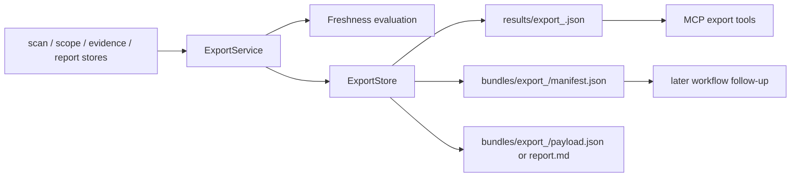
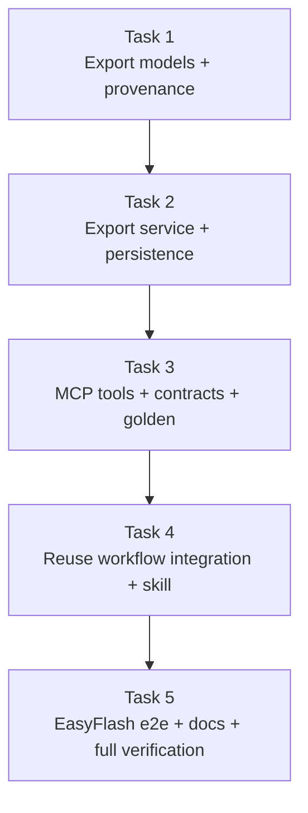

# M5 Export and Asset Reuse Implementation Plan

> **For agentic workers:** REQUIRED SUB-SKILL: Use superpowers:subagent-driven-development (recommended) or superpowers:executing-plans to implement this plan task-by-task. Steps use checkbox (`- [ ]`) syntax for tracking.

**Goal:** Make exported analysis assets real by persisting structured export bundles for reports, scope snapshots, and evidence packs, then proving later workflows can reuse those exported artifacts safely.

**Architecture:** Build M5 around a dedicated `export` domain instead of bolting JSON copying into MCP tools. `report`, `scope`, and `evidence` stay authoritative for source assets; `export.service` assembles portable manifests plus copied payload files under `<target_repo>/.codewiki/export/`, attaches freshness state, and exposes those bundles through real MCP tools. Reuse validation stays practical: later workflows recover stable IDs from exported manifests and continue with existing MCP tools rather than inventing a second “import” API.

**Tech Stack:** Python 3.11 (`/home/hyx/anaconda3/envs/agent/bin/python`), stdlib `dataclasses`/`json`/`hashlib`/`pathlib`, stdlib `unittest`, MCP Python SDK (`mcp[cli]`), existing Node Mermaid runtime from M4, Markdown skill files under `.agents/skills/`

---

## Architecture Sketch





## File Structure

- Create: `src/repo_analysis_tools/export/models.py`
  Responsibility: typed `ExportArtifact`, `FreshnessReport`, and per-export-kind metadata.
- Create: `src/repo_analysis_tools/export/freshness.py`
  Responsibility: evaluate whether exported source assets are still fresh enough for reuse.
- Create: `src/repo_analysis_tools/export/store.py`
  Responsibility: persist `export_<12-hex>` manifests, copied payload files, and `latest.json` under `.codewiki/export/`.
- Create: `src/repo_analysis_tools/export/service.py`
  Responsibility: load report/scope/evidence source assets, build export bundles, and persist them through `ExportStore`.
- Modify: `src/repo_analysis_tools/report/models.py`
  Responsibility: carry enough provenance (`evidence_pack_id`, `scan_id`) for exported analysis bundles.
- Modify: `src/repo_analysis_tools/report/store.py`
  Responsibility: persist the new report provenance fields without breaking M4 report lookups.
- Modify: `src/repo_analysis_tools/report/service.py`
  Responsibility: populate report provenance from evidence-backed render paths.
- Modify: `src/repo_analysis_tools/mcp/contracts/export.py`
  Responsibility: replace M1 stub outputs with real M5 export payload fields.
- Modify: `src/repo_analysis_tools/mcp/tools/export_tools.py`
  Responsibility: replace stub payloads with `ExportService`-backed implementations.
- Modify: `src/repo_analysis_tools/mcp/tools/__init__.py`
  Responsibility: keep exported tool imports aligned if new helpers are exposed.
- Create: `.agents/skills/analysis-maintenance/SKILL.md`
  Responsibility: document the maintenance workflow for freshness checks and export handoff.
- Modify: `docs/architecture.md`
  Responsibility: document export bundle layout, ownership metadata, and reuse workflow.
- Modify: `docs/contracts/mcp-tool-contracts.md`
  Responsibility: document the real M5 export tool payloads.
- Create: `tests/unit/test_export_service.py`
  Responsibility: verify export persistence, manifest structure, ownership, and freshness hints.
- Modify: `tests/unit/test_report_service.py`
  Responsibility: verify report artifacts now persist provenance required by export bundles.
- Modify: `tests/contract/test_tool_contracts.py`
  Responsibility: verify export tool payload shape, error handling, and real service behavior.
- Modify: `tests/golden/test_contract_golden.py`
  Responsibility: snapshot deterministic export tool payloads.
- Create: `tests/golden/fixtures/export_analysis_bundle_scope_first.json`
  Responsibility: golden fixture for exported report bundle payload.
- Create: `tests/golden/fixtures/export_scope_snapshot_scope_first.json`
  Responsibility: golden fixture for exported scope snapshot payload.
- Create: `tests/golden/fixtures/export_evidence_bundle_scope_first.json`
  Responsibility: golden fixture for exported evidence bundle payload.
- Create: `tests/integration/test_export_reuse_workflow.py`
  Responsibility: prove exported manifests can be consumed later by repo-understand, impact, and analysis-writing follow-up flows.
- Create: `tests/e2e/test_export_easyflash.py`
  Responsibility: verify an EasyFlash module-summary export preserves report structure and copied markdown on a real checked-in fixture.

## Working Set

- Parent design: `docs/superpowers/specs/2026-04-17-repo-analysis-platform-design.md`
- M5 spec: `docs/superpowers/specs/2026-04-17-m5-export-and-asset-reuse-spec.md`
- Existing storage helpers: `src/repo_analysis_tools/storage/json_assets.py`
- Existing authoritative asset stores: `src/repo_analysis_tools/scan/store.py`, `src/repo_analysis_tools/scope/store.py`, `src/repo_analysis_tools/evidence/store.py`, `src/repo_analysis_tools/report/store.py`
- Existing MCP export placeholders: `src/repo_analysis_tools/mcp/contracts/export.py`, `src/repo_analysis_tools/mcp/tools/export_tools.py`
- Existing workflow skills: `.agents/skills/repo-understand/SKILL.md`, `.agents/skills/change-impact/SKILL.md`, `.agents/skills/analysis-writing/SKILL.md`
- Existing golden harness: `tests/golden/harness.py`

## Design Assumptions

- M5 exports stay repository-local under `.codewiki/export/`; this phase does not introduce zip files, tarballs, or external publishing formats.
- Exported payloads must stay structured and reviewable. The minimum portable form is `manifest.json` plus copied JSON payload files and, for report bundles, a copied Markdown artifact.
- “Reuse” means a later workflow can recover stable IDs and provenance from exported manifests and continue with existing MCP tools, not that M5 must invent a parallel import protocol.

### Task 1: Add Export Models and Report Provenance

**Files:**
- Create: `src/repo_analysis_tools/export/models.py`
- Modify: `src/repo_analysis_tools/report/models.py`
- Modify: `src/repo_analysis_tools/report/store.py`
- Modify: `src/repo_analysis_tools/report/service.py`
- Modify: `tests/unit/test_report_service.py`
- Create: `tests/unit/test_export_service.py`

- [ ] **Step 1: Write failing provenance tests**

Add assertions to `tests/unit/test_report_service.py` and create `tests/unit/test_export_service.py` so they expect:

```python
self.assertEqual(artifact.evidence_pack_id, evidence_pack.evidence_pack_id)
self.assertEqual(artifact.scan_id, evidence_pack.scan_id)
self.assertEqual(exported.source_kind, "report")
self.assertEqual(exported.owner_tool, "export_analysis_bundle")
```

- [ ] **Step 2: Run the focused unit tests and verify they fail**

Run: `/home/hyx/anaconda3/envs/agent/bin/python -m unittest tests.unit.test_report_service tests.unit.test_export_service -v`
Expected: FAIL because `ReportArtifact` lacks provenance fields and `export.service` / `export.models` do not exist yet.

- [ ] **Step 3: Add typed export models and report provenance**

Create `src/repo_analysis_tools/export/models.py` with dataclasses shaped like:

```python
@dataclass(frozen=True)
class FreshnessReport:
    state: str
    summary: str
    drifted_paths: list[str]

@dataclass(frozen=True)
class ExportArtifact:
    export_id: str
    export_kind: str
    source_kind: str
    source_id: str
    owner_tool: str
    manifest_path: str
    payload_path: str
    copied_paths: list[str]
    freshness: FreshnessReport
```

Extend `src/repo_analysis_tools/report/models.py` so `ReportArtifact` also stores:

```python
evidence_pack_id: str | None
scan_id: str | None
```

Populate those fields in `src/repo_analysis_tools/report/service.py` when rendering from evidence-backed inputs, and persist them in `src/repo_analysis_tools/report/store.py`.

- [ ] **Step 4: Re-run the focused unit tests and verify they pass**

Run: `/home/hyx/anaconda3/envs/agent/bin/python -m unittest tests.unit.test_report_service tests.unit.test_export_service -v`
Expected: PASS for the new provenance assertions; `test_export_service` can still skip service construction until Task 2 fills in persistence.

- [ ] **Step 5: Commit**

```bash
git add src/repo_analysis_tools/export/models.py src/repo_analysis_tools/report/models.py src/repo_analysis_tools/report/store.py src/repo_analysis_tools/report/service.py tests/unit/test_report_service.py tests/unit/test_export_service.py
git commit -m "feat: add export models and report provenance"
```

### Task 2: Implement Export Freshness, Persistence, and Service Logic

**Files:**
- Create: `src/repo_analysis_tools/export/freshness.py`
- Create: `src/repo_analysis_tools/export/store.py`
- Create: `src/repo_analysis_tools/export/service.py`
- Modify: `tests/unit/test_export_service.py`

- [ ] **Step 1: Write failing export-service tests**

Extend `tests/unit/test_export_service.py` to assert real persistence:

```python
self.assertRegex(artifact.export_id, r"^export_[0-9a-f]{12}$")
self.assertTrue(Path(artifact.manifest_path).is_file())
self.assertTrue(Path(artifact.payload_path).is_file())
self.assertEqual(manifest["freshness"]["state"], "fresh")
self.assertEqual(manifest["source"]["kind"], "scope")
```

- [ ] **Step 2: Run the export-service tests and verify they fail**

Run: `/home/hyx/anaconda3/envs/agent/bin/python -m unittest tests.unit.test_export_service -v`
Expected: FAIL with `ModuleNotFoundError` or missing methods such as `ExportService.export_scope_snapshot`.

- [ ] **Step 3: Implement the export domain**

Create `src/repo_analysis_tools/export/store.py` with a layout like:

```python
results/export_<id>.json
bundles/export_<id>/manifest.json
bundles/export_<id>/payload.json
bundles/export_<id>/report.md   # analysis bundle only
latest.json
```

Create `src/repo_analysis_tools/export/freshness.py` with focused helpers:

```python
def evaluate_scope_freshness(target_repo: Path | str, scan_id: str) -> FreshnessReport: ...
def evaluate_evidence_freshness(target_repo: Path | str, evidence_pack: EvidencePack) -> FreshnessReport: ...
def evaluate_report_freshness(target_repo: Path | str, report: ReportArtifact) -> FreshnessReport: ...
```

Create `src/repo_analysis_tools/export/service.py` so it:

- loads source assets from the authoritative stores
- generates `export_<12-hex>`
- copies structured payload JSON into the bundle directory
- copies rendered Markdown for `export_analysis_bundle`
- records `source_kind`, `source_id`, `owner_tool`, `freshness`, and `copied_paths`

- [ ] **Step 4: Re-run export unit tests and verify they pass**

Run: `/home/hyx/anaconda3/envs/agent/bin/python -m unittest tests.unit.test_export_service -v`
Expected: PASS with manifests and copied payload files on disk.

- [ ] **Step 5: Commit**

```bash
git add src/repo_analysis_tools/export/freshness.py src/repo_analysis_tools/export/store.py src/repo_analysis_tools/export/service.py tests/unit/test_export_service.py
git commit -m "feat: implement export service and persistence"
```

### Task 3: Wire Real MCP Export Tools, Contracts, and Golden Fixtures

**Files:**
- Modify: `src/repo_analysis_tools/mcp/contracts/export.py`
- Modify: `src/repo_analysis_tools/mcp/tools/export_tools.py`
- Modify: `tests/contract/test_tool_contracts.py`
- Modify: `tests/golden/test_contract_golden.py`
- Create: `tests/golden/fixtures/export_analysis_bundle_scope_first.json`
- Create: `tests/golden/fixtures/export_scope_snapshot_scope_first.json`
- Create: `tests/golden/fixtures/export_evidence_bundle_scope_first.json`
- Modify: `docs/contracts/mcp-tool-contracts.md`

- [ ] **Step 1: Write failing contract and golden expectations**

Update `tests/contract/test_tool_contracts.py` so export tools must return keys like:

```python
{"target_repo", "runtime_root", "export_id", "export_kind", "manifest_path", "payload_path", "freshness_state", ...}
```

Add deterministic golden assertions in `tests/golden/test_contract_golden.py` for all three export tools.

- [ ] **Step 2: Run contract and golden tests and verify they fail**

Run: `/home/hyx/anaconda3/envs/agent/bin/python -m unittest tests.contract.test_tool_contracts tests.golden.test_contract_golden -v`
Expected: FAIL because `export_tools.py` still returns M1 stub payloads.

- [ ] **Step 3: Replace export stubs with real services**

`src/repo_analysis_tools/mcp/tools/export_tools.py` should follow the same pattern as `report_tools.py`:

```python
try:
    artifact = ExportService().export_scope_snapshot(target_repo, scan_id)
except ValueError as exc:
    return error_response(ErrorCode.INVALID_INPUT, str(exc))
except FileNotFoundError as exc:
    return error_response(ErrorCode.NOT_FOUND, str(exc))
```

Update `src/repo_analysis_tools/mcp/contracts/export.py` so the output schema declares the new real payload fields, and update `docs/contracts/mcp-tool-contracts.md` to match.

- [ ] **Step 4: Re-run contract and golden tests and verify they pass**

Run: `/home/hyx/anaconda3/envs/agent/bin/python -m unittest tests.contract.test_tool_contracts tests.golden.test_contract_golden -v`
Expected: PASS with deterministic export fixtures.

- [ ] **Step 5: Commit**

```bash
git add src/repo_analysis_tools/mcp/contracts/export.py src/repo_analysis_tools/mcp/tools/export_tools.py tests/contract/test_tool_contracts.py tests/golden/test_contract_golden.py tests/golden/fixtures/export_analysis_bundle_scope_first.json tests/golden/fixtures/export_scope_snapshot_scope_first.json tests/golden/fixtures/export_evidence_bundle_scope_first.json docs/contracts/mcp-tool-contracts.md
git commit -m "feat: wire export MCP tools"
```

### Task 4: Prove Cross-Workflow Reuse and Add the Maintenance Skill

**Files:**
- Create: `tests/integration/test_export_reuse_workflow.py`
- Create: `.agents/skills/analysis-maintenance/SKILL.md`
- Modify: `docs/architecture.md`

- [ ] **Step 1: Write the failing reuse workflow test**

Create `tests/integration/test_export_reuse_workflow.py` to prove:

1. repo-understand follow-up can read an exported scope manifest, recover `scan_id`, and continue with `describe_anchor`
2. analysis-writing can read an exported evidence bundle manifest, recover `evidence_pack_id`, and continue with `render_focus_report`
3. exported analysis bundles preserve copied Markdown and report metadata for later review

- [ ] **Step 2: Run the integration test and verify it fails**

Run: `/home/hyx/anaconda3/envs/agent/bin/python -m unittest tests.integration.test_export_reuse_workflow -v`
Expected: FAIL because no export manifests exist yet in the integration path and no maintenance skill documents the flow.

- [ ] **Step 3: Add the maintenance workflow and architecture docs**

Create `.agents/skills/analysis-maintenance/SKILL.md` with the required tool order:

```text
get_scan_status / refresh_scan
-> export_scope_snapshot / export_evidence_bundle / export_analysis_bundle
-> inspect manifest freshness
-> hand recovered IDs or bundle paths to follow-up workflows
```

Update `docs/architecture.md` to document:

- `.codewiki/export/results/export_<id>.json`
- `.codewiki/export/bundles/export_<id>/manifest.json`
- copied payload files and copied Markdown
- freshness ownership fields

- [ ] **Step 4: Re-run the integration test and verify it passes**

Run: `/home/hyx/anaconda3/envs/agent/bin/python -m unittest tests.integration.test_export_reuse_workflow -v`
Expected: PASS with manifest-driven reuse across later workflows.

- [ ] **Step 5: Commit**

```bash
git add tests/integration/test_export_reuse_workflow.py .agents/skills/analysis-maintenance/SKILL.md docs/architecture.md
git commit -m "feat: add export reuse workflow"
```

### Task 5: Validate Exports on EasyFlash and Run Final Verification

**Files:**
- Create: `tests/e2e/test_export_easyflash.py`
- Modify: `tests/smoke/test_package_layout.py`

- [ ] **Step 1: Write the failing EasyFlash export test**

Create `tests/e2e/test_export_easyflash.py` to:

- render a real EasyFlash module summary
- export it with `export_analysis_bundle`
- assert the exported manifest points at a copied Markdown artifact
- assert the copied Markdown still contains `# Module Summary: easyflash` and a Mermaid block

- [ ] **Step 2: Run the new e2e test and verify it fails**

Run: `/home/hyx/anaconda3/envs/agent/bin/python -m unittest tests.e2e.test_export_easyflash -v`
Expected: FAIL until the export bundle layout and copied Markdown path are finalized.

- [ ] **Step 3: Add the final package-layout assertion and finish the implementation**

Update `tests/smoke/test_package_layout.py` so `src/repo_analysis_tools/export` and `.agents/skills/analysis-maintenance/SKILL.md` stay in the expected repository shape.

- [ ] **Step 4: Run focused M5 verification**

Run:

```bash
/home/hyx/anaconda3/envs/agent/bin/python -m unittest tests.unit.test_export_service tests.contract.test_tool_contracts tests.golden.test_contract_golden tests.integration.test_export_reuse_workflow tests.e2e.test_export_easyflash -v
```

Expected: PASS for the new M5 surface.

- [ ] **Step 5: Run the full suite and commit**

Run: `/home/hyx/anaconda3/envs/agent/bin/python -m unittest discover -s tests -t . -v`
Expected: PASS with the expanded M5 test count.

```bash
git add tests/e2e/test_export_easyflash.py tests/smoke/test_package_layout.py
git commit -m "test: cover export reuse on easyflash"
```

## Self-Review Checklist

- Spec coverage:
  - export tools and reusable bundles are covered in Tasks 2 and 3
  - scope snapshots and evidence bundles are covered in Tasks 2 and 3
  - freshness and reuse hooks are covered in Tasks 2 and 4
  - stronger golden comparisons are covered in Task 3
  - later workflow reuse validation is covered in Task 4 and Task 5
- Placeholder scan:
  - no `TODO`, `TBD`, or “implement later” markers remain
  - every task names exact files and exact verification commands
- Type consistency:
  - `ExportArtifact`, `FreshnessReport`, `manifest_path`, `payload_path`, and `freshness_state` are the canonical names used throughout the plan

## Execution Handoff

Plan complete and saved to `docs/superpowers/plans/2026-04-19-m5-export-and-asset-reuse.md`. Since you asked to continue planning and execution, I’ll assume `Subagent-Driven` and start implementing this plan in the current M5 worktree.
