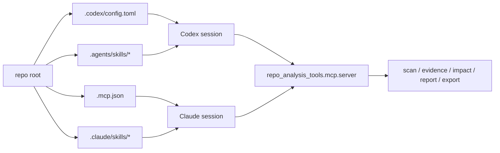
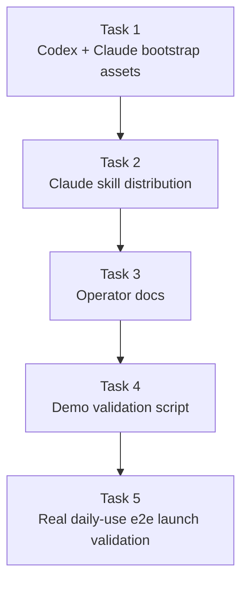

# M6 Self-Use Launch Implementation Plan

> **For agentic workers:** REQUIRED SUB-SKILL: Use superpowers:subagent-driven-development (recommended) or superpowers:executing-plans to implement this plan task-by-task. Steps use checkbox (`- [ ]`) syntax for tracking.

**Goal:** Make this repository the operator's practical day-to-day Codex entry point for real C repository analysis, with a documented Claude-compatible path and repeatable launch validation.

**Architecture:** Keep M6 launch-oriented instead of inventing another product layer. Reuse the M2-M5 MCP workflows as the runtime truth, then add checked-in client bootstrap assets, mirrored workflow skills for Claude, minimal operator documentation, and one deterministic demo path that exercises the real workflow surface on a real C fixture.

**Tech Stack:** Python 3.11 (`/home/hyx/anaconda3/envs/agent/bin/python`), stdlib `unittest`/`json`/`subprocess`/`tempfile`/`tomllib`, checked-in MCP server entrypoint `repo_analysis_tools.mcp.server`, checked-in client config files (`.codex/config.toml`, `.mcp.json`), workflow skill Markdown under `.agents/skills/` and `.claude/skills/`

---

## Launch Sketch





## File Structure

- Create: `.codex/config.toml`
  Responsibility: project-local Codex MCP bootstrap that points at the checked-in Python MCP server entrypoint.
- Create: `.mcp.json`
  Responsibility: project-local Claude MCP bootstrap that points at the same server entrypoint.
- Create: `.claude/skills/repo-understand/SKILL.md`
  Responsibility: Claude-compatible distribution of the repository-understanding workflow skill.
- Create: `.claude/skills/change-impact/SKILL.md`
  Responsibility: Claude-compatible distribution of the change-impact workflow skill.
- Create: `.claude/skills/analysis-writing/SKILL.md`
  Responsibility: Claude-compatible distribution of the report-authoring workflow skill.
- Create: `.claude/skills/analysis-maintenance/SKILL.md`
  Responsibility: Claude-compatible distribution of the export/freshness maintenance workflow skill.
- Modify: `README.md`
  Responsibility: top-level Codex-first quickstart and self-use launch overview.
- Create: `docs/self-use-launch.md`
  Responsibility: compact daily-use playbook covering setup, workflow order, demo run, and when to refresh or export.
- Create: `tools/run_self_use_demo.py`
  Responsibility: deterministic self-use demo that runs the real workflow surface on a real C fixture and prints a machine-readable summary.
- Create: `tests/unit/test_client_bootstrap_assets.py`
  Responsibility: validate the checked-in Codex and Claude bootstrap configs point to the real MCP server entrypoint.
- Create: `tests/unit/test_client_skill_distribution.py`
  Responsibility: validate Claude skill distribution exists and stays semantically aligned with the Codex skill set.
- Create: `tests/unit/test_launch_docs.py`
  Responsibility: validate README and launch docs keep the required self-use setup and workflow guidance.
- Create: `tests/integration/test_self_use_demo.py`
  Responsibility: run the demo script as a process and verify it emits a real end-to-end result summary.
- Create: `tests/e2e/test_self_use_launch_easyflash.py`
  Responsibility: validate a realistic daily-use flow on a real EasyFlash fixture from scan through understanding, evidence, impact, report, and export.
- Modify: `tests/smoke/test_package_layout.py`
  Responsibility: keep the new client config files, Claude skill tree, and launch docs in the expected repository shape.

## Working Set

- M6 spec: `docs/superpowers/specs/2026-04-17-m6-self-use-launch-spec.md`
- Parent design: `docs/superpowers/specs/2026-04-17-repo-analysis-platform-design.md`
- Current MCP entrypoint: `src/repo_analysis_tools/mcp/server.py`
- Current package script declaration: `pyproject.toml`
- Current workflow skills: `.agents/skills/repo-understand/SKILL.md`, `.agents/skills/change-impact/SKILL.md`, `.agents/skills/analysis-writing/SKILL.md`, `.agents/skills/analysis-maintenance/SKILL.md`
- Current real-fixture e2e coverage: `tests/e2e/test_repo_understand_easyflash.py`, `tests/e2e/test_change_impact_easyflash.py`, `tests/e2e/test_analysis_writing_easyflash.py`, `tests/e2e/test_export_easyflash.py`
- Current launch-relevant smoke coverage: `tests/smoke/test_package_layout.py`, `tests/smoke/test_mcp_server.py`
- Historical design note: `docs/gpt5.4proreview.md`

## Design Assumptions

- M6 stays self-use scoped. It does not need marketplace packaging, public installers, or team-wide onboarding polish.
- The repository currently tracks an empty `.codex` file, which blocks the required `.codex/config.toml` directory layout. Because this repository forbids agent-side deletion, implementation must explicitly pause and ask the operator to run the manual replacement command before writing Codex config files.
- Claude compatibility in M6 is distribution compatibility, not a second implementation layer. Skills may be mirrored into `.claude/skills/`, but MCP logic stays single-sourced in Python.
- The demo path should reuse the checked-in EasyFlash fixture machinery and existing MCP tools instead of introducing a synthetic "launch mode."

### Task 1: Add Codex-First And Claude Bootstrap Assets

**Files:**
- Create: `.codex/config.toml`
- Create: `.mcp.json`
- Create: `tests/unit/test_client_bootstrap_assets.py`
- Modify: `tests/smoke/test_package_layout.py`

- [ ] **Step 1: Ask the operator to replace the tracked `.codex` file with a directory**

Because the repository forbids agent-side deletion, stop and request this exact manual command:

```bash
cd /home/hyx/repo-analysis-tools
rm .codex
mkdir .codex
```

Expected: `.codex` is now a directory, so `.codex/config.toml` can be created.

- [ ] **Step 2: Write the failing bootstrap asset tests**

Create `tests/unit/test_client_bootstrap_assets.py` with:

```python
import json
import tomllib
import unittest
from pathlib import Path


ROOT = Path(__file__).resolve().parents[2]


class ClientBootstrapAssetsTest(unittest.TestCase):
    def test_codex_config_points_to_repo_analysis_mcp_server(self) -> None:
        config = tomllib.loads((ROOT / ".codex" / "config.toml").read_text(encoding="utf-8"))
        server = config["mcp_servers"]["repo_analysis_tools"]

        self.assertEqual(server["command"], "/home/hyx/anaconda3/envs/agent/bin/python")
        self.assertEqual(server["args"], ["-m", "repo_analysis_tools.mcp.server"])

    def test_claude_mcp_json_points_to_repo_analysis_mcp_server(self) -> None:
        config = json.loads((ROOT / ".mcp.json").read_text(encoding="utf-8"))
        server = config["mcpServers"]["repo-analysis-tools"]

        self.assertEqual(server["command"], "/home/hyx/anaconda3/envs/agent/bin/python")
        self.assertEqual(server["args"], ["-m", "repo_analysis_tools.mcp.server"])
```

Extend `tests/smoke/test_package_layout.py` so `EXPECTED_FILES` also includes:

```python
ROOT / ".codex" / "config.toml",
ROOT / ".mcp.json",
```

- [ ] **Step 3: Run the bootstrap tests and verify they fail**

Run: `/home/hyx/anaconda3/envs/agent/bin/python -m unittest tests.unit.test_client_bootstrap_assets tests.smoke.test_package_layout -v`
Expected: FAIL because the config files do not exist yet.

- [ ] **Step 4: Add the checked-in client bootstrap files**

Create `.codex/config.toml`:

```toml
[mcp_servers.repo_analysis_tools]
command = "/home/hyx/anaconda3/envs/agent/bin/python"
args = ["-m", "repo_analysis_tools.mcp.server"]
```

Create `.mcp.json`:

```json
{
  "mcpServers": {
    "repo-analysis-tools": {
      "command": "/home/hyx/anaconda3/envs/agent/bin/python",
      "args": ["-m", "repo_analysis_tools.mcp.server"]
    }
  }
}
```

- [ ] **Step 5: Re-run the bootstrap tests and verify they pass**

Run: `/home/hyx/anaconda3/envs/agent/bin/python -m unittest tests.unit.test_client_bootstrap_assets tests.smoke.test_package_layout -v`
Expected: PASS.

- [ ] **Step 6: Commit**

```bash
git add .codex/config.toml .mcp.json tests/unit/test_client_bootstrap_assets.py tests/smoke/test_package_layout.py
git commit -m "feat: add M6 client bootstrap assets"
```

### Task 2: Distribute Claude-Compatible Workflow Skills

**Files:**
- Create: `.claude/skills/repo-understand/SKILL.md`
- Create: `.claude/skills/change-impact/SKILL.md`
- Create: `.claude/skills/analysis-writing/SKILL.md`
- Create: `.claude/skills/analysis-maintenance/SKILL.md`
- Create: `tests/unit/test_client_skill_distribution.py`
- Modify: `tests/smoke/test_package_layout.py`

- [ ] **Step 1: Write the failing skill distribution test**

Create `tests/unit/test_client_skill_distribution.py`:

```python
import unittest
from pathlib import Path


ROOT = Path(__file__).resolve().parents[2]
CODEX_SKILLS = ROOT / ".agents" / "skills"
CLAUDE_SKILLS = ROOT / ".claude" / "skills"
SKILL_NAMES = [
    "repo-understand",
    "change-impact",
    "analysis-writing",
    "analysis-maintenance",
]


def normalize_skill_text(path: Path) -> str:
    return path.read_text(encoding="utf-8").strip()


class ClientSkillDistributionTest(unittest.TestCase):
    def test_every_codex_workflow_skill_has_a_claude_copy(self) -> None:
        for skill_name in SKILL_NAMES:
            codex_path = CODEX_SKILLS / skill_name / "SKILL.md"
            claude_path = CLAUDE_SKILLS / skill_name / "SKILL.md"

            self.assertTrue(codex_path.is_file(), str(codex_path))
            self.assertTrue(claude_path.is_file(), str(claude_path))
            self.assertEqual(normalize_skill_text(codex_path), normalize_skill_text(claude_path))
```

Extend `tests/smoke/test_package_layout.py` with:

```python
ROOT / ".claude" / "skills" / "repo-understand" / "SKILL.md",
ROOT / ".claude" / "skills" / "change-impact" / "SKILL.md",
ROOT / ".claude" / "skills" / "analysis-writing" / "SKILL.md",
ROOT / ".claude" / "skills" / "analysis-maintenance" / "SKILL.md",
```

- [ ] **Step 2: Run the skill distribution tests and verify they fail**

Run: `/home/hyx/anaconda3/envs/agent/bin/python -m unittest tests.unit.test_client_skill_distribution tests.smoke.test_package_layout -v`
Expected: FAIL because `.claude/skills/` does not exist yet.

- [ ] **Step 3: Mirror the workflow skills into `.claude/skills/`**

Run:

```bash
mkdir -p .claude/skills/repo-understand
mkdir -p .claude/skills/change-impact
mkdir -p .claude/skills/analysis-writing
mkdir -p .claude/skills/analysis-maintenance
cp .agents/skills/repo-understand/SKILL.md .claude/skills/repo-understand/SKILL.md
cp .agents/skills/change-impact/SKILL.md .claude/skills/change-impact/SKILL.md
cp .agents/skills/analysis-writing/SKILL.md .claude/skills/analysis-writing/SKILL.md
cp .agents/skills/analysis-maintenance/SKILL.md .claude/skills/analysis-maintenance/SKILL.md
```

- [ ] **Step 4: Re-run the skill distribution tests and verify they pass**

Run: `/home/hyx/anaconda3/envs/agent/bin/python -m unittest tests.unit.test_client_skill_distribution tests.smoke.test_package_layout -v`
Expected: PASS.

- [ ] **Step 5: Commit**

```bash
git add .claude/skills tests/unit/test_client_skill_distribution.py tests/smoke/test_package_layout.py
git commit -m "feat: add Claude-compatible workflow skills"
```

### Task 3: Add Minimal Operator Documentation

**Files:**
- Modify: `README.md`
- Create: `docs/self-use-launch.md`
- Create: `tests/unit/test_launch_docs.py`

- [ ] **Step 1: Write the failing launch docs test**

Create `tests/unit/test_launch_docs.py`:

```python
import unittest
from pathlib import Path


ROOT = Path(__file__).resolve().parents[2]
README = ROOT / "README.md"
LAUNCH_DOC = ROOT / "docs" / "self-use-launch.md"


class LaunchDocsTest(unittest.TestCase):
    def test_readme_contains_codex_first_launch_sections(self) -> None:
        text = README.read_text(encoding="utf-8")

        self.assertIn("Codex Quickstart", text)
        self.assertIn(".codex/config.toml", text)
        self.assertIn(".mcp.json", text)
        self.assertIn("repo-analysis-mcp", text)
        self.assertIn("tools/run_self_use_demo.py", text)

    def test_launch_doc_covers_daily_use_workflow(self) -> None:
        text = LAUNCH_DOC.read_text(encoding="utf-8")

        self.assertIn("scan_repo", text)
        self.assertIn("build_evidence_pack", text)
        self.assertIn("summarize_impact", text)
        self.assertIn("render_module_summary", text)
        self.assertIn("export_analysis_bundle", text)
        self.assertIn("refresh_scan", text)
```

- [ ] **Step 2: Run the docs test and verify it fails**

Run: `/home/hyx/anaconda3/envs/agent/bin/python -m unittest tests.unit.test_launch_docs -v`
Expected: FAIL because the launch docs do not exist yet and README still describes M1.

- [ ] **Step 3: Rewrite the README and add the launch playbook**

Update `README.md` so it contains at least these sections:

````markdown
# Repo Analysis Tools

## Codex Quickstart

1. Use `/home/hyx/anaconda3/envs/agent/bin/python`.
2. Ensure `.codex/config.toml` points at `repo_analysis_tools.mcp.server`.
3. Start Codex in this trusted repository and use the checked-in workflow skills under `.agents/skills/`.

## Claude Compatibility

- `.mcp.json` points at the same MCP server.
- `.claude/skills/` mirrors the workflow skills used by Codex.

## Daily Workflow

1. `scan_repo` / `refresh_scan`
2. repository understanding through evidence
3. optional `summarize_impact`
4. `render_module_summary` or other report tools
5. optional export reuse

## Validation

Run:

```bash
/home/hyx/anaconda3/envs/agent/bin/python tools/run_self_use_demo.py
```
````

Create `docs/self-use-launch.md`:

````markdown
# Self-Use Launch Guide

## Setup

- Codex reads `.codex/config.toml`.
- Claude reads `.mcp.json` and `.claude/skills/`.
- Use `/home/hyx/anaconda3/envs/agent/bin/python`.

## Daily-Use Order

1. `scan_repo` or `refresh_scan`
2. `show_scope`
3. `plan_slice`
4. `build_evidence_pack`
5. `read_evidence_pack` / `open_span`
6. optional `impact_from_paths` + `summarize_impact`
7. `render_module_summary` or `render_focus_report`
8. optional `export_analysis_bundle`

## Demo

Run:

```bash
/home/hyx/anaconda3/envs/agent/bin/python tools/run_self_use_demo.py
```
````

- [ ] **Step 4: Re-run the docs test and verify it passes**

Run: `/home/hyx/anaconda3/envs/agent/bin/python -m unittest tests.unit.test_launch_docs -v`
Expected: PASS.

- [ ] **Step 5: Commit**

```bash
git add README.md docs/self-use-launch.md tests/unit/test_launch_docs.py
git commit -m "docs: add M6 launch guidance"
```

### Task 4: Add A Deterministic Self-Use Demo Script

**Files:**
- Create: `tools/run_self_use_demo.py`
- Create: `tests/integration/test_self_use_demo.py`

- [ ] **Step 1: Write the failing demo integration test**

Create `tests/integration/test_self_use_demo.py`:

```python
import json
import os
import subprocess
import sys
import unittest
from pathlib import Path


ROOT = Path(__file__).resolve().parents[2]


class SelfUseDemoIntegrationTest(unittest.TestCase):
    def test_demo_script_emits_real_launch_summary(self) -> None:
        env = dict(os.environ)
        env["PYTHONPATH"] = str(ROOT / "src")

        result = subprocess.run(
            ["/home/hyx/anaconda3/envs/agent/bin/python", "tools/run_self_use_demo.py"],
            cwd=ROOT,
            env=env,
            capture_output=True,
            text=True,
            check=True,
        )

        payload = json.loads(result.stdout)
        self.assertRegex(payload["scan_id"], r"^scan_[0-9a-f]{12}$")
        self.assertRegex(payload["evidence_pack_id"], r"^evidence_pack_[0-9a-f]{12}$")
        self.assertRegex(payload["impact_id"], r"^impact_[0-9a-f]{12}$")
        self.assertRegex(payload["report_id"], r"^report_[0-9a-f]{12}$")
        self.assertRegex(payload["export_id"], r"^export_[0-9a-f]{12}$")
        self.assertIn("markdown_path", payload)
        self.assertIn("copied_markdown_path", payload)
```

- [ ] **Step 2: Run the demo integration test and verify it fails**

Run: `/home/hyx/anaconda3/envs/agent/bin/python -m unittest tests.integration.test_self_use_demo -v`
Expected: FAIL because the demo script does not exist yet.

- [ ] **Step 3: Add the demo script**

Create `tools/run_self_use_demo.py`:

```python
import json
import tempfile
from pathlib import Path

from repo_analysis_tools.mcp.tools.evidence_tools import build_evidence_pack
from repo_analysis_tools.mcp.tools.export_tools import export_analysis_bundle
from repo_analysis_tools.mcp.tools.impact_tools import impact_from_paths, summarize_impact
from repo_analysis_tools.mcp.tools.report_tools import render_module_summary
from repo_analysis_tools.mcp.tools.scan_tools import refresh_scan, scan_repo
from repo_analysis_tools.mcp.tools.slice_tools import plan_slice
from tests.fixtures.easyflash_repo import materialize_easyflash_repo


def main() -> None:
    with tempfile.TemporaryDirectory() as tmpdir:
        repo = materialize_easyflash_repo(Path(tmpdir))
        scan_payload = scan_repo(str(repo))
        refresh_payload = refresh_scan(str(repo), scan_payload["data"]["scan_id"])
        slice_payload = plan_slice(str(repo), "Where is easyflash_init defined?")
        evidence_payload = build_evidence_pack(str(repo), slice_payload["data"]["slice_id"])
        impact_payload = impact_from_paths(
            str(repo),
            ["easyflash/src/easyflash.c"],
            refresh_payload["data"]["scan_id"],
        )
        _ = summarize_impact(str(repo), impact_payload["data"]["impact_id"])
        report_payload = render_module_summary(
            str(repo),
            evidence_payload["data"]["evidence_pack_id"],
            "easyflash",
        )
        export_payload = export_analysis_bundle(str(repo), report_payload["data"]["report_id"])

        print(
            json.dumps(
                {
                    "repo_root": str(repo),
                    "scan_id": refresh_payload["data"]["scan_id"],
                    "evidence_pack_id": evidence_payload["data"]["evidence_pack_id"],
                    "impact_id": impact_payload["data"]["impact_id"],
                    "report_id": report_payload["data"]["report_id"],
                    "export_id": export_payload["data"]["export_id"],
                    "markdown_path": report_payload["data"]["markdown_path"],
                    "copied_markdown_path": export_payload["data"]["copied_markdown_path"],
                }
            )
        )


if __name__ == "__main__":
    main()
```

- [ ] **Step 4: Re-run the demo integration test and verify it passes**

Run: `/home/hyx/anaconda3/envs/agent/bin/python -m unittest tests.integration.test_self_use_demo -v`
Expected: PASS.

- [ ] **Step 5: Commit**

```bash
git add tools/run_self_use_demo.py tests/integration/test_self_use_demo.py
git commit -m "feat: add self-use launch demo"
```

### Task 5: Validate The Real Daily-Use Launch Flow

**Files:**
- Create: `tests/e2e/test_self_use_launch_easyflash.py`
- Modify: `tests/smoke/test_package_layout.py`

- [ ] **Step 1: Write the failing daily-use e2e test**

Create `tests/e2e/test_self_use_launch_easyflash.py`:

```python
import tempfile
import unittest
from pathlib import Path

from repo_analysis_tools.mcp.tools.anchors_tools import find_anchor
from repo_analysis_tools.mcp.tools.evidence_tools import build_evidence_pack, open_span
from repo_analysis_tools.mcp.tools.export_tools import export_analysis_bundle
from repo_analysis_tools.mcp.tools.impact_tools import impact_from_paths, summarize_impact
from repo_analysis_tools.mcp.tools.report_tools import render_module_summary
from repo_analysis_tools.mcp.tools.scan_tools import refresh_scan, scan_repo
from repo_analysis_tools.mcp.tools.slice_tools import plan_slice
from tests.fixtures.easyflash_repo import materialize_easyflash_repo


class SelfUseLaunchEasyflashTest(unittest.TestCase):
    def test_daily_use_flow_runs_from_scan_to_export(self) -> None:
        with tempfile.TemporaryDirectory() as tmpdir:
            repo = materialize_easyflash_repo(Path(tmpdir))

            scan_payload = scan_repo(str(repo))
            refresh_payload = refresh_scan(str(repo), scan_payload["data"]["scan_id"])
            find_payload = find_anchor(str(repo), "easyflash_init", refresh_payload["data"]["scan_id"])
            slice_payload = plan_slice(str(repo), "Where is easyflash_init defined?")
            evidence_payload = build_evidence_pack(str(repo), slice_payload["data"]["slice_id"])
            span_payload = open_span(
                str(repo),
                evidence_payload["data"]["evidence_pack_id"],
                "easyflash/src/easyflash.c",
                65,
                65,
            )
            impact_payload = impact_from_paths(
                str(repo),
                ["easyflash/src/easyflash.c"],
                refresh_payload["data"]["scan_id"],
            )
            summary_payload = summarize_impact(str(repo), impact_payload["data"]["impact_id"])
            report_payload = render_module_summary(
                str(repo),
                evidence_payload["data"]["evidence_pack_id"],
                "easyflash",
            )
            export_payload = export_analysis_bundle(str(repo), report_payload["data"]["report_id"])

            self.assertEqual(find_payload["status"], "ok")
            self.assertEqual(find_payload["data"]["matches"][0]["path"], "easyflash/src/easyflash.c")
            self.assertIn("EfErrCode easyflash_init(void)", span_payload["data"]["lines"][0])
            self.assertTrue(summary_payload["data"]["risks"])
            self.assertEqual(report_payload["data"]["document_type"], "module-summary")
            self.assertEqual(export_payload["data"]["export_kind"], "analysis-bundle")
```

Add these file expectations to `tests/smoke/test_package_layout.py` if they are not already covered:

```python
ROOT / "docs" / "self-use-launch.md",
ROOT / "tools" / "run_self_use_demo.py",
ROOT / ".claude" / "skills" / "repo-understand" / "SKILL.md",
```

- [ ] **Step 2: Run the new e2e test and verify it fails**

Run: `/home/hyx/anaconda3/envs/agent/bin/python -m unittest tests.e2e.test_self_use_launch_easyflash -v`
Expected: FAIL because the new e2e file does not exist yet.

- [ ] **Step 3: Finish the launch validation surface**

In `tests/e2e/test_self_use_launch_easyflash.py`, keep the final assertions explicit and launch-scoped:

```python
self.assertEqual(refresh_payload["status"], "ok")
self.assertGreaterEqual(evidence_payload["data"]["citation_count"], 1)
self.assertTrue(summary_payload["data"]["regression_focus"])
self.assertIn("# Module Summary: easyflash", Path(report_payload["data"]["markdown_path"]).read_text(encoding="utf-8"))
self.assertTrue(Path(export_payload["data"]["copied_markdown_path"]).is_file())
```

In `tests/smoke/test_package_layout.py`, keep the launch file expectations explicit:

```python
ROOT / ".codex" / "config.toml",
ROOT / ".mcp.json",
ROOT / ".claude" / "skills" / "repo-understand" / "SKILL.md",
ROOT / "docs" / "self-use-launch.md",
ROOT / "tools" / "run_self_use_demo.py",
```

Do not add new MCP business logic here unless one of these checks exposes a concrete launch blocker.

- [ ] **Step 4: Run focused M6 verification**

Run:

```bash
/home/hyx/anaconda3/envs/agent/bin/python -m unittest tests.unit.test_client_bootstrap_assets tests.unit.test_client_skill_distribution tests.unit.test_launch_docs tests.integration.test_self_use_demo tests.e2e.test_self_use_launch_easyflash tests.smoke.test_package_layout -v
```

Expected: PASS.

- [ ] **Step 5: Run the full suite and commit**

Run: `/home/hyx/anaconda3/envs/agent/bin/python -m unittest discover -s tests -t . -v`
Expected: PASS with the expanded M6 test count.

```bash
git add tests/e2e/test_self_use_launch_easyflash.py tests/smoke/test_package_layout.py
git commit -m "test: validate M6 self-use launch flow"
```

## Self-Review Checklist

- Spec coverage:
  - Codex-first bootstrap and install path is covered in Task 1.
  - Claude-compatible skill distribution is covered in Task 2.
  - Minimal operator documentation is covered in Task 3.
  - Demo or smoke validation script is covered in Task 4.
  - End-to-end daily-use validation on a real C repository is covered in Task 5.
- Placeholder scan:
  - The `.codex` file collision is called out explicitly as a manual operator prerequisite instead of being hidden.
  - Every task names concrete files, concrete tests, and exact commands.
- Type consistency:
  - Bootstrap file names are fixed as `.codex/config.toml` and `.mcp.json`.
  - The launch validation script is fixed as `tools/run_self_use_demo.py`.
  - The launch e2e is fixed as `tests/e2e/test_self_use_launch_easyflash.py`.

## Execution Handoff

Plan complete and saved to `docs/superpowers/plans/2026-04-19-m6-self-use-launch.md`. Two execution options:

1. Subagent-Driven (recommended) - I dispatch a fresh subagent per task, review between tasks, fast iteration

2. Inline Execution - Execute tasks in this session using executing-plans, batch execution with checkpoints

Which approach?
