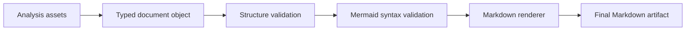
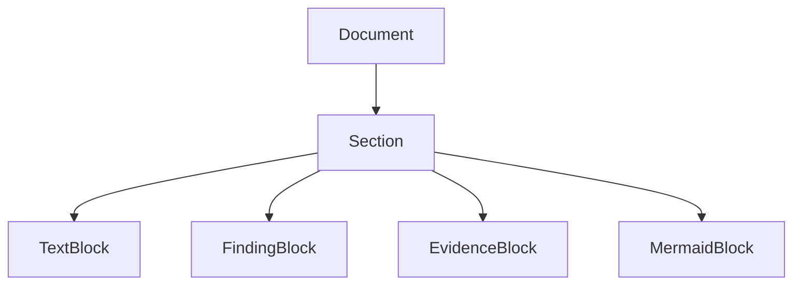
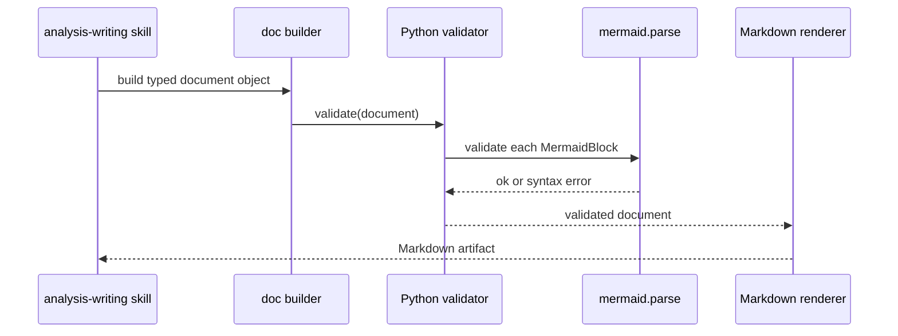

# M4 Document DSL and Rendering Spec

> Parent spec: `docs/superpowers/specs/2026-04-17-repo-analysis-platform-design.md`
>
> Milestone: `M4`

## 1. Goal

Create the structured document system that turns analysis outputs into typed document objects and renders them into Markdown through Python.

This phase establishes disciplined, diagram-rich document generation instead of free-form text output. Mermaid diagrams are first-class document blocks in M4, not ad hoc Markdown snippets.

## 2. Scope

Included:

- document specs for initial document types
- typed document DSL models
- first-class Mermaid block support
- validation rules
- Markdown rendering pipeline
- Python-owned Mermaid validation adapter
- first analysis-writing workflow skill

Excluded:

- arbitrary prose generation without structure
- SVG or PNG diagram rendering
- multi-engine diagram abstraction such as `graphviz` or `plantuml`
- alternate output formats unless they directly support the Markdown path
- public publishing workflows

## 3. Document Types

M4 must define initial specs for:

- `module-summary`
- `issue-analysis`
- `design-note`
- `review-report`

Each spec must define:

- required sections
- expected evidence sources
- mandatory fields
- conclusion requirements
- citation or evidence-binding expectations
- Mermaid usage policy by section: required, allowed, or disallowed

Diagram-rich output is expected when the subject matter is structural, procedural, causal, or dependency-oriented. `design-note` and `module-summary` should prefer Mermaid diagrams in those cases instead of forcing prose-only explanations.

## 4. DSL Requirement

The document DSL source of truth must use typed Python models, preferably `pydantic` or `dataclass`.

Those models must be able to represent:

- metadata
- section hierarchy
- typed content blocks
- findings
- interpretation
- unknowns
- risks
- recommendations
- evidence bindings

Serialization to YAML or JSON is allowed as a storage or debug format, but not as the primary design center.

M4 must define Mermaid as a first-class block in the DSL. The section body model must not treat diagrams as raw Markdown strings.

The Mermaid block model must include at least:

- `diagram_kind`
- `source`
- `caption`
- `placement`
- `evidence_bindings`
- optional `title`

The DSL should allow more than one Mermaid block in a document and more than one Mermaid block in a section when the document spec allows it.

## 5. Validation Requirement

Validation remains Python-owned. M4 must not require workflow skills or operators to call Mermaid tooling directly.

The required validation order is:

1. document structure validation
2. Mermaid block syntax validation
3. Markdown rendering

Mermaid syntax validation must use a Python-side validator adapter that invokes the official Mermaid parser entry point `mermaid.parse(text)`.

If any Mermaid block is invalid, the document object must fail validation and must not be rendered into a final Markdown artifact.

## 6. Rendering Requirement

The renderer must:

- validate document objects before rendering
- enforce document structure
- standardize heading layout
- standardize Mermaid fenced-block layout
- standardize evidence and citation formatting
- write final Markdown output

The renderer is a required Python stage, not a formatting afterthought.

Renderer output for Mermaid blocks must be stable and predictable. Upstream builders should hand over structured Mermaid blocks, while the renderer is responsible for producing the final fenced Markdown form and placing captions and evidence references consistently.

M4 renderers must support multiple Mermaid diagrams per document where the document spec allows them.

## 7. Skill Requirement

M4 must introduce an `analysis-writing` workflow skill that:

- chooses a document type
- gathers relevant analysis assets
- builds a typed document object
- validates it against the spec
- validates Mermaid blocks through the Python validator adapter
- renders Markdown through Python

The workflow must not jump directly from evidence to unstructured Markdown drafting.

## 8. Acceptance Criteria

M4 is complete when:

- initial document specs are defined
- typed DSL models exist and are usable
- Mermaid block models exist and are usable
- validation rules prevent structurally incomplete documents
- Mermaid syntax validation blocks invalid diagrams before render
- Markdown rendering works end to end with Mermaid-rich documents
- the writing workflow consumes analysis outputs instead of bypassing them

## 9. Risks

Main risks:

- drifting back to plain Markdown templates
- sneaking Mermaid diagrams in as raw Markdown strings instead of DSL blocks
- making the DSL too weak to capture evidence structure
- over-abstracting too early into a generic multi-diagram engine
- embedding rendering logic into workflow skill text

Control measures:

- keep specs and DSL types explicit
- keep Mermaid as an explicit block type
- keep a single Python-owned validator adapter around the official Mermaid parser
- require Python rendering
- validate before render
- defer non-Mermaid diagram engines until a later phase proves they are needed

## 10. Handoff to M5

M4 hands off:

- document specs
- typed document models
- Mermaid block support in the DSL
- Python-side Mermaid syntax validation
- render pipeline
- workflow hooks for document generation

M5 can then focus on portability and reuse of those outputs.
